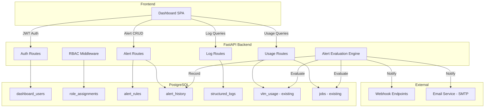

# Design Document: Admin Dashboard

## Overview

The Admin Dashboard adds an operational visibility and control layer on top of the existing PDF Ingestion Pipeline. It provides a separate authentication system (JWT-based, independent of tenant API keys), role-based access control, usage analytics, structured log viewing, and a configurable alerting engine.

The dashboard is built as an extension of the existing FastAPI backend with new route modules, and a new React SPA section in the frontend. It reads from existing database tables (VLMUsage, Job, DeliveryLog) and introduces new tables for dashboard users, alert rules, alert history, and structured log storage.

### Key Design Decisions

1. **Separate auth from tenant API keys**: Dashboard users authenticate via email/password → JWT. This keeps operator access independent from programmatic tenant API keys.
2. **Read from existing VLMUsage table**: Usage aggregation queries the existing `vlm_usage` table directly rather than duplicating data into a separate analytics store.
3. **Structured logs stored in PostgreSQL**: Logs are written to a `structured_logs` table via a structlog processor, enabling SQL-based querying with trace correlation. This avoids introducing a separate log aggregation service for the MVP.
4. **Alert evaluation as a background task**: The alert engine runs as an async periodic task within the FastAPI process, evaluating rules on a configurable interval.
5. **No external UI library**: Consistent with the existing frontend, the dashboard uses inline styles and native React patterns.

## Architecture



### Request Flow

1. User authenticates via `POST /v1/admin/auth/login` → receives JWT
2. All subsequent requests include `Authorization: Bearer <jwt>`
3. RBAC middleware decodes JWT, extracts role + tenant assignments
4. Route handler checks permission (role + tenant scope) before executing
5. Response returned with standard `APIResponse` envelope

## Components and Interfaces

### Backend Components

#### 1. Auth Service (`api/routes/admin_auth.py`)

Handles user registration (admin-only), login, token refresh, and logout.

```python
# Endpoints
POST /v1/admin/auth/login        → { access_token, token_type, expires_in }
POST /v1/admin/auth/logout       → { success: true }
POST /v1/admin/auth/refresh      → { access_token, token_type, expires_in }
POST /v1/admin/users             → { user_id, email, role }  # Admin only
GET  /v1/admin/users             → [{ user_id, email, role, tenant_ids }]
PUT  /v1/admin/users/{user_id}   → { user_id, email, role, tenant_ids }
DELETE /v1/admin/users/{user_id} → { success: true }
```

#### 2. RBAC Middleware (`api/middleware/rbac.py`)

Decodes JWT, resolves user identity, and enforces role-based permissions.

```python
class Permission(Enum):
    READ = "read"
    WRITE = "write"
    ADMIN = "admin"

def require_permission(permission: Permission, tenant_id: str | None = None):
    """FastAPI dependency that enforces RBAC."""
    ...
```

**Role → Permission Matrix:**

| Action | Admin | Operator (assigned) | Viewer (assigned) | Unassigned |
|--------|-------|--------------------|--------------------|------------|
| Read usage | ✓ | ✓ | ✓ | ✗ |
| Read logs | ✓ | ✓ | ✓ | ✗ |
| Manage alerts | ✓ | ✓ | ✗ | ✗ |
| Acknowledge alerts | ✓ | ✓ | ✗ | ✗ |
| Manage users | ✓ | ✗ | ✗ | ✗ |

#### 3. Usage Service (`api/routes/admin_usage.py`)

Queries the existing `vlm_usage` table with aggregation and filtering.

```python
# Endpoints
GET /v1/admin/usage                    → { data: [...], pagination }
GET /v1/admin/usage/summary            → { total_input, total_output, total_cost, by_model: [...] }
GET /v1/admin/usage/timeseries         → { buckets: [{ period, input_tokens, output_tokens, cost }] }
```

**Query Parameters:**
- `tenant_id` (optional) — filter by tenant
- `job_id` (optional) — filter by job
- `model_id` (optional) — filter by model
- `start_time` / `end_time` (ISO 8601) — time range
- `granularity` (day | week | month) — for timeseries
- `page` / `page_size` — pagination

#### 4. Log Service (`api/routes/admin_logs.py`)

Queries the `structured_logs` table with filtering and pagination.

```python
# Endpoints
GET /v1/admin/logs                     → { data: [...], pagination }
GET /v1/admin/logs/trace/{trace_id}    → { data: [...] }
```

**Query Parameters:**
- `tenant_id`, `job_id`, `trace_id` — filters
- `severity` (debug | info | warning | error | critical) — minimum severity
- `start_time` / `end_time` — time range
- `page` / `page_size` — pagination (default 50, max 200)

#### 5. Alert Service (`api/routes/admin_alerts.py`)

CRUD for alert rules and alert history viewing.

```python
# Endpoints
GET    /v1/admin/alerts/rules          → [{ rule_id, type, config, status }]
POST   /v1/admin/alerts/rules          → { rule_id, ... }
PUT    /v1/admin/alerts/rules/{id}     → { rule_id, ... }
DELETE /v1/admin/alerts/rules/{id}     → { success: true }
GET    /v1/admin/alerts/history        → [{ alert_id, rule_id, fired_at, resolved_at, ... }]
POST   /v1/admin/alerts/{alert_id}/ack → { acknowledged: true }
```

#### 6. Alert Evaluation Engine (`pipeline/alerts/engine.py`)

Background async task that periodically evaluates alert rules.

```python
class AlertEngine:
    """Evaluates alert rules on a configurable interval."""

    async def start(self, interval_seconds: int = 60): ...
    async def stop(self): ...
    async def evaluate_all_rules(self): ...
    async def evaluate_budget_rule(self, rule: AlertRule): ...
    async def evaluate_error_rate_rule(self, rule: AlertRule): ...
    async def handle_circuit_breaker_event(self, event: CircuitBreakerEvent): ...
```

**Evaluation Logic:**
- Budget alerts: Sum `vlm_usage.input_tokens + output_tokens` for tenant in current billing period, compare to threshold
- Error rate alerts: Count `jobs` with status='failed' / total jobs in evaluation window
- Circuit breaker alerts: Event-driven (not polled) — triggered by circuit breaker state changes

#### 7. Notification Dispatcher (`pipeline/alerts/notifier.py`)

Sends notifications via configured channels.

```python
class NotificationDispatcher:
    async def send(self, channel: str, payload: AlertNotification): ...
    async def send_webhook(self, url: str, payload: dict): ...
    async def send_email(self, to: str, subject: str, body: str): ...
```

#### 8. Log Sink Processor (`api/middleware/log_sink.py`)

A structlog processor that writes log entries to the `structured_logs` table.

```python
def db_log_sink(logger, method_name, event_dict) -> dict:
    """Structlog processor that persists log entries to PostgreSQL."""
    ...
```

### Frontend Components

#### Dashboard Layout

```
AdminApp
├── LoginPage
├── DashboardLayout (authenticated)
│   ├── Sidebar (navigation)
│   ├── UsagePage
│   │   ├── UsageFilters
│   │   ├── UsageChart (time-series)
│   │   └── UsageTable
│   ├── LogsPage
│   │   ├── LogFilters
│   │   ├── LogTable
│   │   └── LogDetailPanel (expandable)
│   ├── AlertsPage
│   │   ├── AlertRuleList
│   │   ├── AlertRuleForm (create/edit)
│   │   └── AlertHistory
│   └── UsersPage (Admin only)
│       ├── UserList
│       └── UserForm
```

#### State Management

- JWT stored in memory (not localStorage) for security; refresh token in httpOnly cookie
- React Context for auth state (`AuthContext`)
- `useFetch` hook for API calls with automatic JWT injection
- No external state library — component-local state + context is sufficient for this scope

## Data Models

### New Database Tables

#### `dashboard_users`

| Column | Type | Constraints |
|--------|------|-------------|
| id | UUID | PK, default uuid4 |
| email | TEXT | UNIQUE, NOT NULL |
| password_hash | TEXT | NOT NULL |
| role | VARCHAR(20) | NOT NULL (admin, operator, viewer) |
| is_active | BOOLEAN | NOT NULL, default true |
| created_at | TIMESTAMPTZ | NOT NULL, default now() |
| updated_at | TIMESTAMPTZ | NOT NULL, default now() |

#### `role_assignments`

| Column | Type | Constraints |
|--------|------|-------------|
| id | SERIAL | PK |
| user_id | UUID | FK → dashboard_users.id, NOT NULL |
| tenant_id | TEXT | FK → tenants.id, NOT NULL |
| created_at | TIMESTAMPTZ | NOT NULL, default now() |

Unique constraint on `(user_id, tenant_id)`.

#### `alert_rules`

| Column | Type | Constraints |
|--------|------|-------------|
| id | UUID | PK, default uuid4 |
| name | TEXT | NOT NULL |
| rule_type | VARCHAR(30) | NOT NULL (budget, error_rate, circuit_breaker) |
| tenant_id | TEXT | FK → tenants.id, nullable (null = global) |
| config | JSONB | NOT NULL |
| notification_channel | VARCHAR(20) | NOT NULL (webhook, email) |
| notification_target | TEXT | NOT NULL (URL or email address) |
| enabled | BOOLEAN | NOT NULL, default true |
| state | VARCHAR(20) | NOT NULL, default 'idle' (idle, firing, resolved) |
| last_evaluated_at | TIMESTAMPTZ | nullable |
| created_by | UUID | FK → dashboard_users.id |
| created_at | TIMESTAMPTZ | NOT NULL, default now() |
| updated_at | TIMESTAMPTZ | NOT NULL, default now() |

**`config` JSONB structure by rule_type:**

- `budget`: `{ "threshold_tokens": int, "billing_period": "monthly" | "weekly" }`
- `error_rate`: `{ "threshold_percent": float, "evaluation_window_minutes": int }`
- `circuit_breaker`: `{ "service_name": str }`

#### `alert_history`

| Column | Type | Constraints |
|--------|------|-------------|
| id | SERIAL | PK |
| rule_id | UUID | FK → alert_rules.id, NOT NULL |
| tenant_id | TEXT | nullable |
| fired_at | TIMESTAMPTZ | NOT NULL |
| resolved_at | TIMESTAMPTZ | nullable |
| notification_sent | BOOLEAN | NOT NULL, default false |
| acknowledged_by | UUID | FK → dashboard_users.id, nullable |
| acknowledged_at | TIMESTAMPTZ | nullable |
| context | JSONB | nullable (threshold value, actual value, etc.) |

#### `structured_logs`

| Column | Type | Constraints |
|--------|------|-------------|
| id | BIGSERIAL | PK |
| timestamp | TIMESTAMPTZ | NOT NULL |
| severity | VARCHAR(10) | NOT NULL |
| event_name | TEXT | NOT NULL |
| tenant_id | TEXT | nullable |
| job_id | UUID | nullable |
| trace_id | TEXT | nullable |
| message | TEXT | nullable |
| fields | JSONB | nullable (all additional structured fields) |

**Indexes:**
- `idx_logs_trace_id` on `trace_id`
- `idx_logs_tenant_time` on `(tenant_id, timestamp)`
- `idx_logs_severity_time` on `(severity, timestamp)`
- `idx_logs_job_id` on `job_id`

#### `token_revocations`

| Column | Type | Constraints |
|--------|------|-------------|
| id | SERIAL | PK |
| jti | TEXT | UNIQUE, NOT NULL |
| revoked_at | TIMESTAMPTZ | NOT NULL, default now() |
| expires_at | TIMESTAMPTZ | NOT NULL |

Used for JWT logout/invalidation. Entries are cleaned up after `expires_at` passes.

### Pydantic Models (API Layer)

```python
# Request/Response models for usage
class UsageQuery(BaseModel):
    tenant_id: str | None = None
    job_id: str | None = None
    model_id: str | None = None
    start_time: datetime | None = None
    end_time: datetime | None = None
    granularity: Literal["day", "week", "month"] = "day"
    page: int = 1
    page_size: int = 50

class UsageSummary(BaseModel):
    total_input_tokens: int
    total_output_tokens: int
    total_tokens: int
    estimated_cost: float
    by_model: list[ModelUsage]

class ModelUsage(BaseModel):
    model_id: str
    input_tokens: int
    output_tokens: int
    total_tokens: int
    estimated_cost: float

# Alert rule models
class AlertRuleCreate(BaseModel):
    name: str
    rule_type: Literal["budget", "error_rate", "circuit_breaker"]
    tenant_id: str | None = None
    config: dict
    notification_channel: Literal["webhook", "email"]
    notification_target: str
    enabled: bool = True

class AlertRuleResponse(BaseModel):
    id: str
    name: str
    rule_type: str
    tenant_id: str | None
    config: dict
    notification_channel: str
    notification_target: str
    enabled: bool
    state: str
    last_evaluated_at: datetime | None
    created_at: datetime
```

### Integration with Existing Pipeline

**Usage data flow:**
1. VLM calls already write to `vlm_usage` table (existing behavior)
2. Dashboard queries `vlm_usage` directly with aggregation SQL
3. No additional write path needed — the existing pipeline is the data source

**Log data flow:**
1. Add `db_log_sink` as a structlog processor in the existing `_configure_structlog()` function
2. All existing `logger.info(...)` calls automatically flow to `structured_logs` table
3. Existing JSON log output to stdout is preserved (dual output)

**Circuit breaker events:**
1. When delivery circuit breaker state changes, emit a `CircuitBreakerEvent`
2. Alert engine subscribes to these events and evaluates circuit breaker rules
3. State stored in `alert_rules.state` field

### Configuration

New settings added to `api/config.py`:

```python
# Admin Dashboard
jwt_secret_key: str = "change-me-in-production"
jwt_algorithm: str = "HS256"
jwt_expiration_hours: int = 8
alert_evaluation_interval_seconds: int = 60
token_cost_per_1k_input: float = 0.003   # per model override in JSONB
token_cost_per_1k_output: float = 0.015
smtp_host: str | None = None
smtp_port: int = 587
smtp_from: str = "alerts@pdf-ingestion.local"
```

## Correctness Properties

*A property is a characteristic or behavior that should hold true across all valid executions of a system — essentially, a formal statement about what the system should do. Properties serve as the bridge between human-readable specifications and machine-verifiable correctness guarantees.*

### Property 1: Usage filter correctness

*For any* set of VLM usage records and any combination of filters (tenant_id, job_id, model_id, time range), the Usage_Tracker SHALL return only records that match ALL specified filters, and no matching record shall be excluded.

**Validates: Requirements 1.1, 1.2, 1.3, 1.5**

### Property 2: Cost computation accuracy

*For any* token count (input_tokens, output_tokens) and configured per-token rate for a model, the computed cost SHALL equal `input_tokens * input_rate / 1000 + output_tokens * output_rate / 1000`.

**Validates: Requirements 1.4**

### Property 3: Time granularity bucketing

*For any* set of usage records with timestamps and any granularity (day, week, month), each record SHALL be assigned to exactly one bucket, and the bucket boundaries SHALL align with calendar boundaries for the specified granularity.

**Validates: Requirements 1.6**

### Property 4: Log filter and ordering

*For any* set of structured log entries and any combination of filters (trace_id, tenant_id, job_id, severity, time range), the Log_Viewer SHALL return only entries matching ALL filters, in chronological order, with no matching entry excluded.

**Validates: Requirements 3.1, 3.2, 3.3, 3.4, 3.5**

### Property 5: Severity level filtering

*For any* severity filter level and any set of log entries, the Log_Viewer SHALL return only entries with severity at or above the specified level, respecting the ordering: debug < info < warning < error < critical.

**Validates: Requirements 3.4**

### Property 6: Pagination invariants

*For any* result set and valid page size (1–200), paginating the results SHALL produce pages where each page has at most `page_size` entries, and the union of all pages equals the complete result set with no duplicates or omissions.

**Validates: Requirements 3.6**

### Property 7: RBAC access control

*For any* user with a non-Admin role and any tenant, access SHALL be granted if and only if the tenant is explicitly assigned to that user. Write access SHALL be granted only to users with Admin or Operator role. Admin users SHALL have access to all tenants regardless of assignments.

**Validates: Requirements 5.2, 5.3, 5.4, 5.5, 5.6**

### Property 8: Role assignment persistence round-trip

*For any* valid role assignment (user_id, tenant_id, role), creating the assignment and then checking access for that user to that tenant SHALL reflect the new assignment.

**Validates: Requirements 5.7**

### Property 9: JWT claims round-trip

*For any* authenticated user with a role and set of tenant assignments, the generated JWT token SHALL contain claims that, when decoded, yield the same role and tenant assignments.

**Validates: Requirements 6.2**

### Property 10: JWT rejection for invalid tokens

*For any* JWT that is expired, malformed, or signed with an incorrect key, the Dashboard_API SHALL reject it with a 401 response.

**Validates: Requirements 6.3**

### Property 11: Alert rule persistence round-trip

*For any* valid alert rule (budget or error_rate type), creating the rule and reading it back SHALL yield identical field values for all persisted fields.

**Validates: Requirements 7.1, 8.1**

### Property 12: Budget threshold detection

*For any* budget alert rule with a threshold T and any sequence of usage records for the rule's tenant, the Alert_Manager SHALL emit a notification if and only if the cumulative token count crosses T within the billing period.

**Validates: Requirements 7.2**

### Property 13: Alert notification idempotence

*For any* alert rule in firing state, repeated evaluations within the same breach period SHALL produce at most one notification. A new notification SHALL only be emitted after a recovery event.

**Validates: Requirements 7.5, 8.5**

### Property 14: Disabled rules produce no notifications

*For any* disabled alert rule, the Alert_Manager SHALL not emit notifications regardless of whether the threshold condition is met.

**Validates: Requirements 7.4**

### Property 15: Error rate calculation and threshold detection

*For any* error rate alert rule with threshold P% and evaluation window W minutes, the Alert_Manager SHALL emit a notification if and only if `(failed_jobs / total_jobs) * 100 > P` within the window, where total_jobs > 0.

**Validates: Requirements 8.2**

### Property 16: Error rate recovery notification

*For any* error rate alert rule currently in firing state, when the error rate drops below the threshold, the Alert_Manager SHALL emit exactly one recovery notification.

**Validates: Requirements 8.4**

### Property 17: Circuit breaker state transition notifications

*For any* circuit breaker state transition, the Alert_Manager SHALL emit a firing notification on closed→open and a recovery notification on open→closed, with the affected service and tenant identified.

**Validates: Requirements 9.1, 9.2**

### Property 18: Alert rule validation

*For any* alert rule submission with invalid parameters (missing required fields, invalid threshold values, unsupported channel), the Dashboard_API SHALL return a 422 response with a descriptive error message.

**Validates: Requirements 10.5**

### Property 19: Combined filter AND logic

*For any* set of log entries and any combination of N filters applied simultaneously, the result SHALL equal the intersection of applying each filter individually.

**Validates: Requirements 4.4**

## Error Handling

### Authentication Errors

| Scenario | HTTP Status | Error Code | Response |
|----------|-------------|------------|----------|
| Missing credentials | 401 | `ERR_DASH_AUTH_001` | "Missing credentials" |
| Invalid credentials | 401 | `ERR_DASH_AUTH_002` | "Invalid email or password" |
| Expired JWT | 401 | `ERR_DASH_AUTH_003` | "Token expired" |
| Invalid JWT | 401 | `ERR_DASH_AUTH_004` | "Invalid token" |
| Revoked JWT | 401 | `ERR_DASH_AUTH_005` | "Token revoked" |

### Authorization Errors

| Scenario | HTTP Status | Error Code | Response |
|----------|-------------|------------|----------|
| Insufficient role | 403 | `ERR_DASH_RBAC_001` | "Insufficient permissions" |
| Tenant not assigned | 403 | `ERR_DASH_RBAC_002` | "Access denied for tenant" |

### Validation Errors

| Scenario | HTTP Status | Error Code | Response |
|----------|-------------|------------|----------|
| Invalid alert rule params | 422 | `ERR_DASH_VALID_001` | Field-level validation errors |
| Invalid time range | 422 | `ERR_DASH_VALID_002` | "start_time must be before end_time" |
| Page size exceeds max | 422 | `ERR_DASH_VALID_003` | "page_size must be <= 200" |

### Alert Engine Errors

- **Notification delivery failure**: Log error, mark alert as `notification_failed` in history, retry on next evaluation cycle
- **Database query timeout**: Log warning, skip evaluation cycle, retry on next interval
- **Circuit breaker event processing failure**: Log error, do not suppress the event — retry on next state change

### General Error Strategy

- All errors follow the existing `APIResponse` envelope with error details
- Structured logging with `trace_id` correlation for all error paths
- No sensitive information (passwords, tokens) in error responses
- Rate limiting on auth endpoints (5 attempts per minute per IP) to prevent brute force

## Testing Strategy

### Property-Based Tests (using Hypothesis)

Each correctness property maps to a property-based test with minimum 100 iterations:

- **Usage filter correctness** (Property 1): Generate random VLM usage records, apply random filter combinations, verify only matching records returned
- **Cost computation** (Property 2): Generate random token counts and rates, verify arithmetic
- **Granularity bucketing** (Property 3): Generate random timestamps, verify bucket assignment
- **Log filter and ordering** (Property 4): Generate random log entries, apply filters, verify correctness and ordering
- **Severity filtering** (Property 5): Generate random entries with severities, verify level-based filtering
- **Pagination** (Property 6): Generate random result sets, verify pagination invariants
- **RBAC** (Property 7): Generate random users/roles/assignments, verify access decisions
- **JWT round-trip** (Property 9): Generate random user profiles, verify JWT encode/decode
- **Alert threshold detection** (Properties 12, 15): Generate random usage/job sequences, verify threshold crossing detection
- **Notification idempotence** (Property 13): Generate repeated evaluations, verify single notification

**Library**: `hypothesis` (Python PBT library)
**Configuration**: `@settings(max_examples=100)` minimum per test
**Tagging**: Each test tagged with `# Feature: admin-dashboard, Property N: <description>`

### Unit Tests (pytest)

- Auth login/logout flow with valid and invalid credentials
- JWT expiration behavior
- Alert rule CRUD operations
- Notification dispatcher (mocked HTTP/SMTP)
- Log sink processor output format
- UI component rendering (React Testing Library)

### Integration Tests

- Full auth flow: login → access protected endpoint → logout → verify rejection
- Usage query against seeded database
- Alert engine evaluation cycle with seeded data
- Circuit breaker event → notification flow

### Frontend Tests (Vitest + React Testing Library)

- Component rendering with mock data
- Filter interaction behavior
- Auth context state management
- API error handling display
