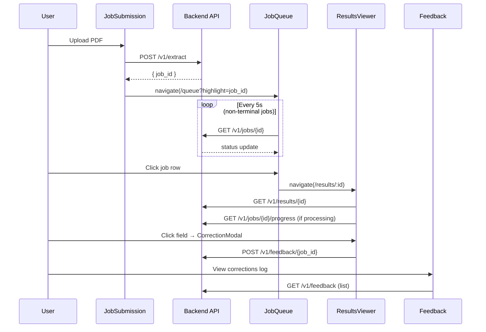

# Design Document: Operational Frontend Redesign

## Overview

This design decomposes the existing monolithic `PdfExtractor.jsx` component (~800 lines) into a multi-screen React application with four focused views: Job Submission, Job Queue, Results Viewer, and Feedback Log. The redesign introduces client-side routing via React Router, a CSS custom property design token system, and a library of reusable presentational components.

The architecture prioritises:
- **Separation of concerns**: each screen owns its data fetching and state; shared UI primitives live in a component library
- **Minimal dependencies**: React Router for routing, CSS variables for theming — no state management library, no component framework
- **Incremental migration**: the existing `DeliverySettings` and `RedactionSettings` screens remain untouched and are mounted under their existing routes

### Key Design Decisions

| Decision | Rationale |
|----------|-----------|
| React Router v6 (not v7) | Stable, well-documented, no need for framework features |
| CSS custom properties (not CSS-in-JS) | Zero runtime cost, easy to override, works with plain JSX |
| No global state library | Each screen fetches its own data; polling state is local. A shared `useApi` hook is sufficient |
| Flat file structure under `src/` | MVP has ~15 files total — nested folders add navigation cost without benefit at this scale |
| No TypeScript | Matches existing codebase; can be added later without architectural changes |

---

## Architecture

### High-Level Component Tree

```
<BrowserRouter>
  <AppShell>                    ← persistent nav + layout chrome
    <Routes>
      /submit        → <JobSubmissionScreen />
      /queue         → <JobQueueScreen />
      /results/:id   → <ResultsViewerScreen />
      /feedback      → <FeedbackScreen />
      /settings/delivery   → <DeliverySettings />   (existing)
      /settings/redaction  → <RedactionSettings />  (existing)
      /              → redirect to /submit
    </Routes>
  </AppShell>
</BrowserRouter>
```

### Data Flow



### File Structure

```
pdf_ingestion/frontend/src/
├── main.jsx                    # Entry point (unchanged)
├── App.jsx                     # BrowserRouter + Routes
├── tokens.css                  # Design tokens (CSS custom properties)
├── global.css                  # Reset + base typography
├── hooks/
│   └── useApi.js               # Shared fetch wrapper with auth header
├── components/
│   ├── AppShell.jsx            # Nav sidebar + content area
│   ├── ConfidenceBadge.jsx
│   ├── JobStatusBadge.jsx
│   ├── SchemaTypeTag.jsx
│   ├── MonospaceField.jsx
│   ├── ProvenanceTooltip.jsx
│   ├── AbstentionRow.jsx
│   ├── CorrectionModal.jsx
│   └── DataTable.jsx           # Generic sortable/scrollable table
├── screens/
│   ├── JobSubmissionScreen.jsx
│   ├── JobQueueScreen.jsx
│   ├── ResultsViewerScreen.jsx
│   └── FeedbackScreen.jsx
├── DeliverySettings.jsx        # Existing (moved to settings route)
└── admin/                      # Existing admin app (unchanged)
```

---

## Components and Interfaces

### AppShell

The persistent layout wrapper providing navigation and screen chrome.

```jsx
// Props: { children }
// Renders:
//   - Left sidebar (200px) with nav links + active indicator
//   - Header area with app title "PDF Ingestion" and subtitle
//   - Main content area (children)
```

**Navigation items:**
| Label | Route | Icon |
|-------|-------|------|
| Submit Job | /submit | ↑ |
| Job Queue | /queue | ☰ |
| Results | /results | ◉ |
| Feedback | /feedback | ✎ |
| Delivery | /settings/delivery | ⚙ |
| Redaction | /settings/redaction | 🔒 |

Active link is determined by `useLocation()` matching the route prefix.

### ConfidenceBadge

```jsx
// Props: { value: number }  — value in range [0, 1]
// Renders: pill with formatted value (2 decimal places)
// Colour logic:
//   value >= 0.90 → var(--color-success)  green
//   value >= 0.70 → var(--color-warning)  amber
//   value <  0.70 → var(--color-error)    red
```

### JobStatusBadge

```jsx
// Props: { status: 'queued' | 'processing' | 'complete' | 'failed' | 'abstained' }
// Colour map:
//   queued     → var(--color-slate)
//   processing → var(--color-info)     blue
//   complete   → var(--color-success)
//   failed     → var(--color-error)
//   abstained  → var(--color-warning)
```

### SchemaTypeTag

```jsx
// Props: { type: string }
// Label map:
//   bank_statement     → "Bank Statement"
//   custody_statement  → "Custody Statement"
//   swift_confirm      → "SWIFT Confirm"
//   unknown            → "Unknown"
// Renders: tag with neutral background and formatted label
```

### MonospaceField

```jsx
// Props: { children: string }
// Renders: <span> with monospace font, subtle background tint (#f1f5f9)
```

### ProvenanceTooltip

```jsx
// Props: { page, bbox: [x1,y1,x2,y2], sourceRail, rule }
// Renders: hover-triggered tooltip (CSS :hover + absolute positioning)
// Content: page number, bbox in monospace, source rail label, rule name
```

### AbstentionRow

```jsx
// Props: { fieldName, reasonCode, detail, vlmAttempted }
// Renders: table row with amber left border + light amber background
```

### CorrectionModal

```jsx
// Props: { open, onClose, jobId, fieldName, currentValue, onSuccess }
// State: correctedValue (string), submitting (bool), error (string|null)
// Behaviour:
//   - Submit disabled when correctedValue is empty
//   - POST /v1/feedback/{jobId} with { field_name, original_value, corrected_value }
//   - On success: calls onSuccess(), closes
//   - On error: displays error, stays open
```

### DataTable

```jsx
// Props: { columns: [{key, label, align, render}], rows: [], onRowClick? }
// Renders: compact table with sticky header, horizontal scroll, hover highlight
// Used by: JobQueueScreen, FeedbackScreen, ResultsViewer tables panel
```

### useApi Hook

```jsx
// useApi(path, options?) → { data, loading, error, refetch }
// Handles:
//   - Prepending base URL (empty string for Vite proxy)
//   - Adding Authorization header (Bearer demo-key)
//   - JSON parsing of response envelope (unwraps .data if present)
//   - Error extraction from response body
```

---

## Data Models

### Job (from GET /v1/jobs/{id})

```
{
  job_id: string,
  schema_type: 'bank_statement' | 'custody_statement' | 'swift_confirm' | 'unknown',
  status: 'queued' | 'processing' | 'complete' | 'failed' | 'abstained',
  pages: number,
  submitted_at: string (ISO 8601),
  completed_at: string | null,
  overall_confidence: number | null
}
```

### Progress (from GET /v1/jobs/{id}/progress)

```
{
  progress_percent: number,
  pages_processed: number,
  total_pages: number,
  current_stage: string,
  elapsed_seconds: number,
  estimated_remaining_seconds: number | null,
  vlm_windows_complete: number,
  vlm_total_windows: number
}
```

### ExtractionResult (from GET /v1/results/{id})

```
{
  output: {
    schema_type: string,
    pipeline_version: string,
    fields: { [field_name]: { value, confidence, vlm_used, provenance } },
    tables: [{ table_id, type, page_range, headers, rows, triangulation }],
    abstentions: [{ field, table_id, reason, detail, vlm_attempted }],
    validation: { passed: boolean, failures: [{ validator_name, field_name, error_code, detail }] }
  }
}
```

### FeedbackEntry (from GET /v1/feedback)

```
{
  job_id: string,
  field_name: string,
  original_value: string,
  corrected_value: string,
  submitted_by: string,
  submitted_at: string (ISO 8601)
}
```

### Provenance (nested in field objects)

```
{
  page: number,
  bbox: [x1, y1, x2, y2],
  source_rail: 'native' | 'ocr' | 'vlm',
  rule: string
}
```

---


## Correctness Properties

*A property is a characteristic or behavior that should hold true across all valid executions of a system — essentially, a formal statement about what the system should do. Properties serve as the bridge between human-readable specifications and machine-verifiable correctness guarantees.*

### Property 1: AND-filter correctness

*For any* list of jobs and any combination of active filters (schema_type set, status set, date range), the filtered result SHALL contain only jobs that satisfy ALL active filter criteria simultaneously, and SHALL contain every job from the original list that satisfies all criteria.

**Validates: Requirements 3.8**

### Property 2: ConfidenceBadge colour threshold mapping

*For any* numeric confidence value in the range [0, 1], the ConfidenceBadge component SHALL render with green (#2ECC71) background when value ≥ 0.90, amber (#F39C12) background when 0.70 ≤ value < 0.90, and red (#E74C3C) background when value < 0.70.

**Validates: Requirements 12.1**

### Property 3: CSV export round-trip

*For any* array of feedback entries (where field values may contain commas, double quotes, newlines, and Unicode characters), exporting to CSV and parsing the resulting CSV back SHALL produce values equivalent to the original entries with all special characters preserved.

**Validates: Requirements 9.4**

### Property 4: Validation failure grouping integrity

*For any* list of validation failure objects with varying validator_name values, grouping by validator_name SHALL produce groups where: (a) every failure in a group has the same validator_name, (b) the union of all groups equals the original list, and (c) no failure appears in more than one group.

**Validates: Requirements 8.3**

### Property 5: Correction submit button enablement

*For any* string value, the CorrectionModal submit button SHALL be disabled if and only if the trimmed value is empty (i.e., the string consists entirely of whitespace characters or is the empty string).

**Validates: Requirements 10.5**

### Property 6: Financial identifier monospace rendering

*For any* field whose name matches a financial identifier pattern (iban, isin, bic, swift_code, account_number, doc_hash), the Results Viewer SHALL render its value using the MonospaceField component.

**Validates: Requirements 5.3**

---

## Error Handling

### API Errors

| Scenario | Behaviour |
|----------|-----------|
| Network failure (fetch throws) | Display "Connection error" inline with retry suggestion |
| HTTP 4xx response | Extract `detail` from JSON body, display in error banner |
| HTTP 5xx response | Display "Server error — please try again" with status code |
| Timeout (polling > 30 min) | Stop polling, display "Processing timed out" message |
| Malformed JSON response | Display "Unexpected response format" error |

### Component-Level Error Boundaries

Each screen component wraps its content in a lightweight error boundary that catches render errors and displays a "Something went wrong" fallback with a reload button. This prevents a crash in one screen from breaking navigation.

### Upload Validation Errors

| Condition | Message |
|-----------|---------|
| Non-PDF file type | "Only PDF files are accepted" |
| File > 50 MB | "File exceeds maximum size of 50 MB" |
| No file selected | "Please select a PDF file" |

### Polling Resilience

- If a single poll request fails, the next poll still fires (transient errors don't stop polling)
- After 3 consecutive poll failures, display a warning banner but continue polling
- Polling stops only for terminal job statuses (complete, failed, abstained) or user navigation away

---

## Testing Strategy

### Unit Tests (Vitest + React Testing Library)

Unit tests cover specific examples, edge cases, and component rendering:

- **Component rendering**: Each reusable component (ConfidenceBadge, JobStatusBadge, SchemaTypeTag, MonospaceField, AbstentionRow) renders correctly with representative props
- **Screen structure**: Each screen renders expected elements given mock data
- **User interactions**: Click handlers, form submissions, modal open/close
- **Error states**: Error messages display for failed API calls, validation errors
- **Edge cases**: Empty data arrays, null confidence values, missing fields

### Property-Based Tests (fast-check)

Property tests verify universal correctness guarantees using the `fast-check` library with minimum 100 iterations per property:

| Property | What it tests | Generator strategy |
|----------|---------------|-------------------|
| P1: AND-filter correctness | `filterJobs(jobs, filters)` | Random arrays of job objects + random filter combinations |
| P2: Confidence colour mapping | `getConfidenceColour(value)` | Random floats in [0, 1] with bias toward boundaries (0.70, 0.90) |
| P3: CSV round-trip | `parseCSV(exportCSV(entries))` | Random feedback entries with special characters |
| P4: Grouping integrity | `groupByValidator(failures)` | Random arrays of failure objects with random validator_names |
| P5: Submit enablement | `isSubmitEnabled(value)` | Random strings including whitespace-only, empty, and mixed |
| P6: Monospace field detection | `isFinancialIdentifier(fieldName)` | Random field names from known identifier set + random non-identifier names |

**Configuration:**
- Library: `fast-check` (npm package)
- Minimum iterations: 100 per property
- Tag format: `Feature: operational-frontend-redesign, Property {N}: {title}`

### Integration Tests

- API call verification with mocked `fetch` (correct endpoints, headers, payloads)
- Navigation flows (submit → queue → results)
- Polling behaviour with fake timers

### What is NOT tested with PBT

- UI rendering and layout (use snapshot/visual tests)
- Component composition (which component renders inside which — use example tests)
- Navigation and routing (use integration tests)
- Async polling behaviour (use timer-based integration tests)
