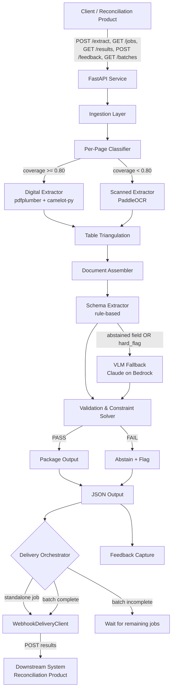
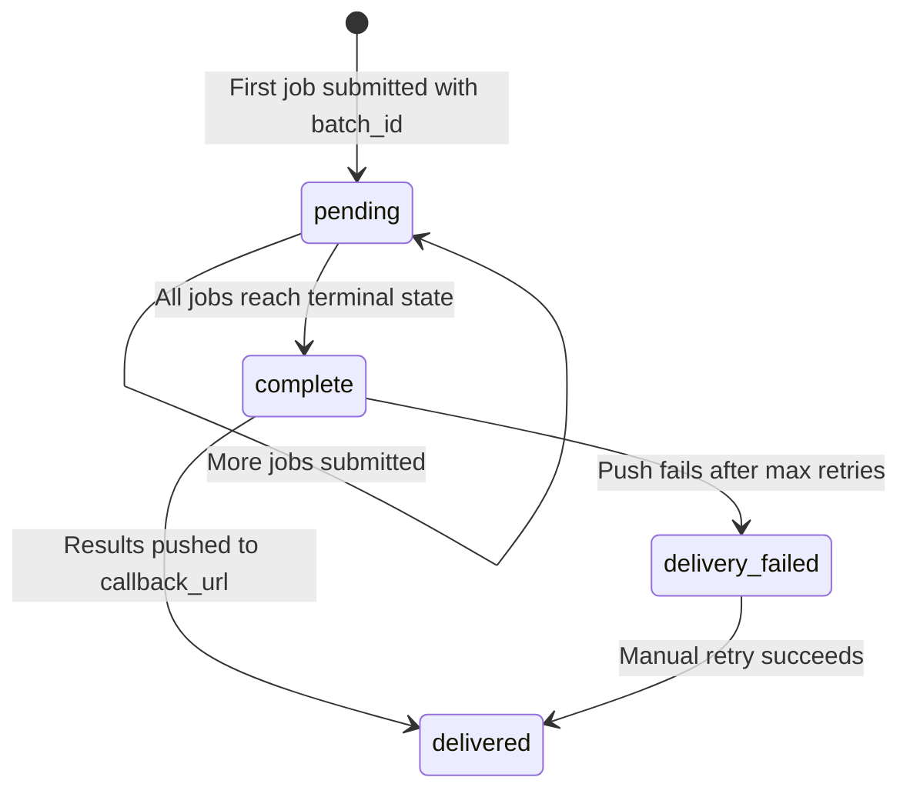
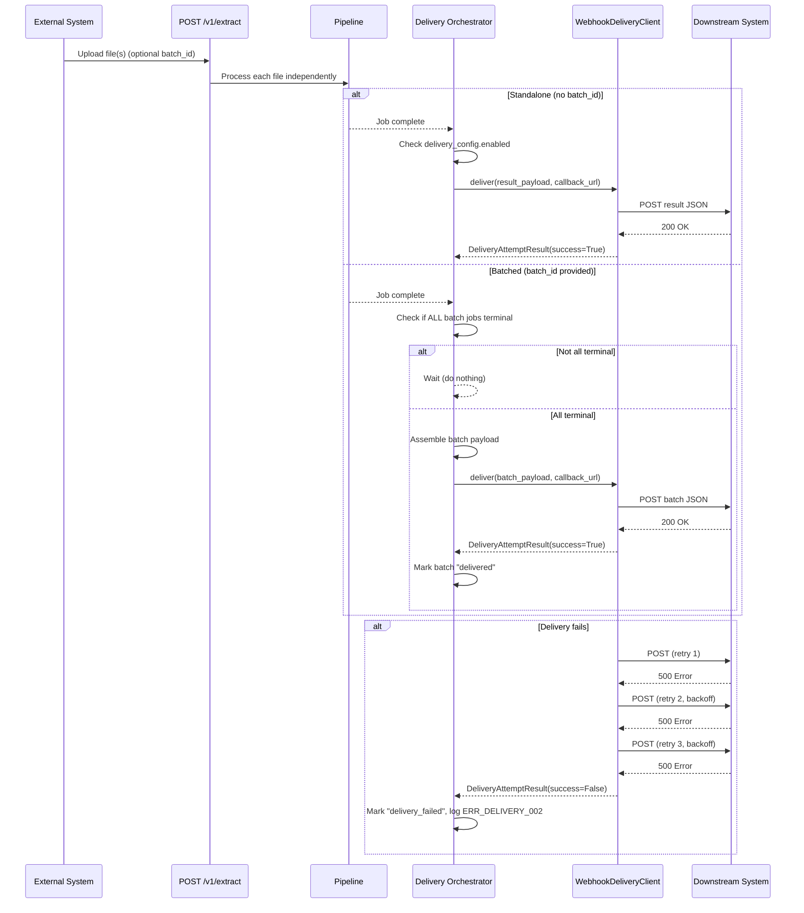
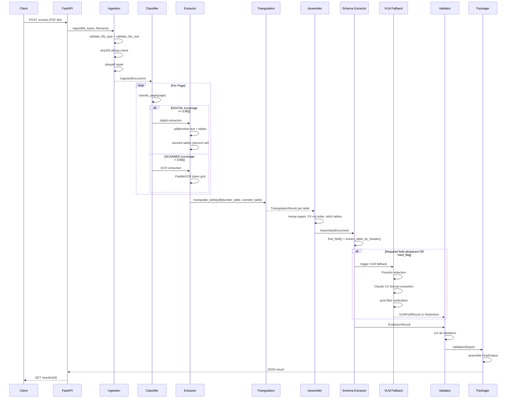
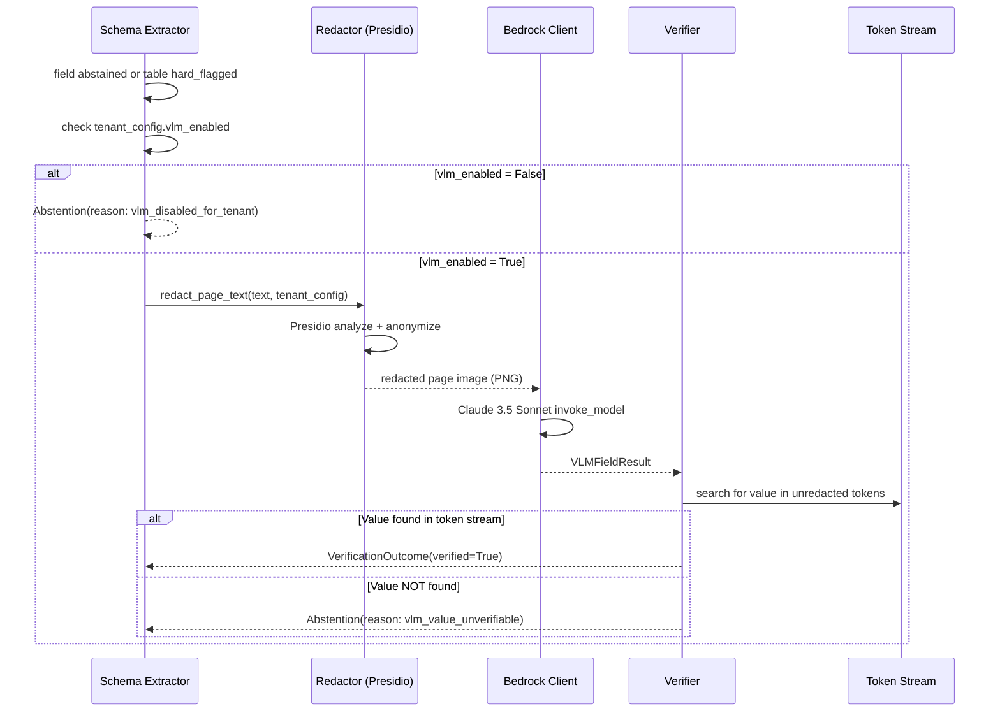
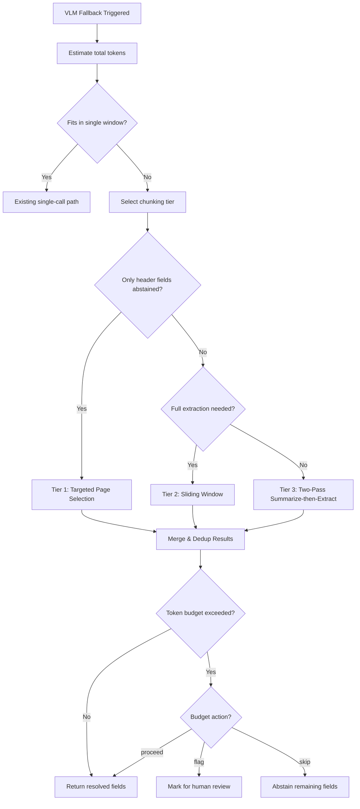
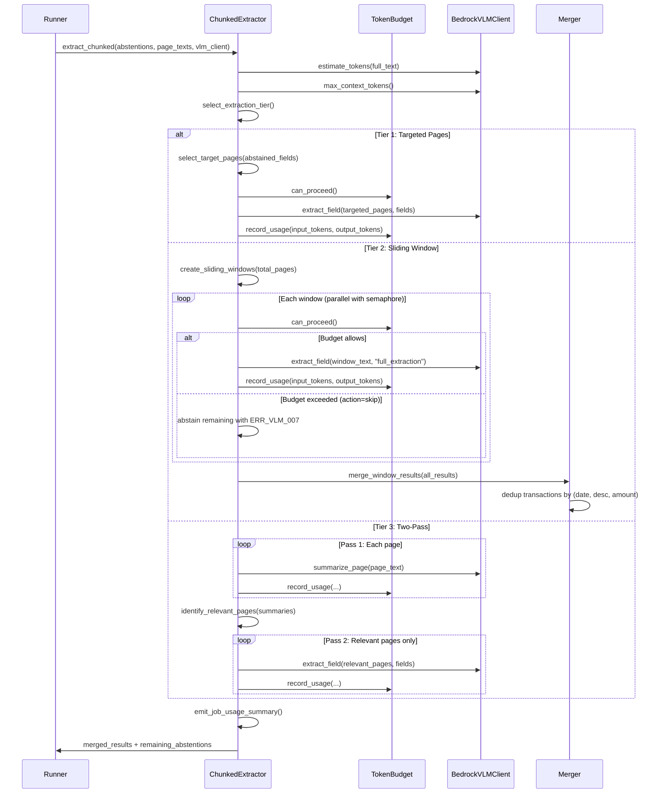

# Design Document: PDF Ingestion Layer

## Overview

The PDF Ingestion Layer is a production-ready extraction service for the reconciliation product. It processes bank/custody statements and SWIFT/broker trade confirmations, extracting structured data with full provenance tracking. The system is designed for a single developer to build in four weeks, targeting 500–1,000 documents per month.

The architecture follows a pipeline pattern with discrete stages: ingestion, classification, extraction, triangulation, assembly, schema extraction, VLM fallback, validation, and packaging. Every extracted field carries page number and bounding box provenance. The system abstains rather than fabricates — a missing value is always preferable to a wrong value in a reconciliation context.

The PDF profile is predominantly digital (selectable text), with scanned page handling as a self-hosted fallback via PaddleOCR. Table extraction uses dual-rail triangulation (pdfplumber vs camelot-py) to surface disagreement as a quality signal. Claude 3.5 Sonnet on AWS Bedrock serves as a conditional VLM fallback for hard cases, gated by per-tenant consent and Presidio redaction.

## Engineering Standards

> These standards are mandatory. Every instruction here applies to all code produced for this project.
> They are additive to the main design — nothing below contradicts an existing decision; they enforce
> how those decisions are implemented.

### Ports & Adapters — All External Dependencies

Every external dependency — AWS Bedrock, Presidio, PaddleOCR — must be wrapped behind an
internal interface (port). No pipeline stage may import or call a vendor SDK directly.
This makes every dependency swappable and every pipeline stage unit-testable in isolation.

```python
# pipeline/ports.py

from abc import ABC, abstractmethod
from pipeline.models import Token, VLMFieldResult, RedactionLog, EntityRedactionConfig


class VLMClientPort(ABC):
    """
    Abstraction over any vision-language model used for field extraction fallback.
    Swap implementations (Bedrock, Azure OpenAI, local) by changing the binding — not the pipeline.
    """
    @abstractmethod
    def extract_field(
        self,
        page_image: bytes,
        field_name: str,
        field_description: str,
        schema_type: str,
    ) -> VLMFieldResult: ...

    @abstractmethod
    def estimate_tokens(self, text: str) -> int:
        """Model-aware token estimation."""
        ...

    @abstractmethod
    def max_context_tokens(self) -> int:
        """Return the model's context window size."""
        ...


class RedactorPort(ABC):
    """
    Abstraction over any PII/PI redaction engine.
    Pipeline code never imports Presidio directly.
    """
    @abstractmethod
    def redact_page_text(
        self,
        text: str,
        config: list[EntityRedactionConfig],
    ) -> tuple[str, RedactionLog]: ...


class OCRClientPort(ABC):
    """
    Abstraction over any OCR backend.
    Allows swapping PaddleOCR for a different engine without touching the pipeline.
    """
    @abstractmethod
    def extract_tokens(self, page_image: bytes) -> list[Token]: ...


class IngestionTriggerPort(ABC):
    """
    Abstraction over the mechanism that triggers document ingestion.
    Initial adapter: HTTP POST /v1/extract.
    Future adapters (out of scope Month 1): S3 event notifications, webhook receiver.
    """
    @abstractmethod
    async def receive(self) -> "IngestionEvent": ...


class DeliveryPort(ABC):
    """
    Abstraction over the outbound push mechanism for delivering extraction results.
    Initial adapter: WebhookDeliveryClient (HTTP POST to tenant callback_url).
    Future adapters (out of scope): SQS, RabbitMQ, etc.
    """
    @abstractmethod
    async def deliver(
        self,
        payload: dict,
        callback_url: str,
        auth_header: str | None = None,
    ) -> "DeliveryAttemptResult": ...
```

**Hard rule:** No file in `pipeline/` may contain `import boto3`, `import presidio_analyzer`,
or `import paddleocr`. Those imports belong only in the concrete adapter files under
`pipeline/vlm/` and `pipeline/extractors/`.

Concrete implementations (`BedrockVLMClient`, `PageRedactor`, `PaddleOCRClient`, `WebhookDeliveryClient`) live in
`pipeline/vlm/`, `pipeline/extractors/`, and `pipeline/delivery.py` and implement these ports. The pipeline only ever
receives the port type. Bindings are wired in `api/main.py` at startup via dependency injection.

Mock implementations for testing:

```python
# tests/mocks.py

class MockVLMClient(VLMClientPort):
    """Returns fixture responses. No network calls. Used in all unit and integration tests."""
    def __init__(self, fixture: VLMFieldResult):
        self._fixture = fixture

    def extract_field(self, page_image, field_name, field_description, schema_type):
        return self._fixture

    def estimate_tokens(self, text: str) -> int:
        return int(len(text) / 3.5)

    def max_context_tokens(self) -> int:
        return 200_000


class MockRedactor(RedactorPort):
    """Returns text unchanged with empty redaction log."""
    def redact_page_text(self, text, config):
        return text, RedactionLog(entities_redacted=[], redacted_count=0, config_snapshot=[])


class MockOCRClient(OCRClientPort):
    """Returns fixture tokens. No network calls."""
    def __init__(self, fixture: list[Token]):
        self._fixture = fixture

    def extract_tokens(self, page_image):
        return self._fixture


class MockDeliveryClient(DeliveryPort):
    """Records delivery attempts. No network calls. Used in all unit and integration tests."""
    def __init__(self, should_succeed: bool = True):
        self._should_succeed = should_succeed
        self.attempts: list[dict] = []

    async def deliver(self, payload, callback_url, auth_header=None):
        self.attempts.append({"payload": payload, "url": callback_url, "auth": auth_header})
        if self._should_succeed:
            return DeliveryAttemptResult(success=True, status_code=200)
        return DeliveryAttemptResult(success=False, status_code=500, error="mock failure")
```

### Authentication & Tenant Authorisation

No route handler may be invoked without a verified tenant identity.

**Middleware — identity verification (AuthN):**

```python
# api/middleware/auth.py

from fastapi import Request, HTTPException
from api.models.tenant import TenantContext

async def resolve_tenant(request: Request) -> TenantContext:
    """
    Extracts and validates the API key from the Authorization header.
    Resolves the associated tenant record from the database.
    Raises HTTP 401 if the key is missing or invalid.
    Raises HTTP 403 if the tenant is suspended.
    """
    api_key = request.headers.get("Authorization", "").removeprefix("Bearer ")
    if not api_key:
        raise HTTPException(status_code=401, detail="ERR_AUTH_001: missing credentials")
    tenant = await tenant_repo.get_by_api_key(api_key)
    if not tenant:
        raise HTTPException(status_code=401, detail="ERR_AUTH_002: invalid credentials")
    if tenant.is_suspended:
        raise HTTPException(status_code=403, detail="ERR_AUTH_003: tenant suspended")
    request.state.tenant = tenant
    return tenant
```

**Business layer — tenant scoping (AuthZ):**

Every database query that touches `jobs`, `results`, or `feedback` must include a
`tenant_id` filter sourced from `request.state.tenant.id`. This is not optional — it must
be explicit on every query.

```python
# Correct — tenant-scoped
result = await db.execute(
    select(Result).where(Result.job_id == job_id, Result.tenant_id == tenant.id)
)

# Violation — unscoped query, never acceptable
result = await db.execute(select(Result).where(Result.job_id == job_id))
```

The `vlm_enabled` flag check is a business-layer authorisation decision. It must live in
`pipeline/vlm/bedrock_client.py` before any VLM call, not in the route handler.

### Structured Logging & Distributed Tracing

Every log line in this service must be structured JSON. No `print()`. No `logging.info("string")`.

**Setup:** Use `structlog` with JSON output. Configure once in `api/main.py` at startup:

```python
import structlog

structlog.configure(
    processors=[
        structlog.contextvars.merge_contextvars,
        structlog.processors.add_log_level,
        structlog.processors.TimeStamper(fmt="iso"),
        structlog.processors.JSONRenderer(),
    ]
)
```

**TraceId propagation:** A `trace_id` is generated at ingress on `POST /v1/extract` and stored
on the `Job` record. It must be bound to the logging context for every operation that follows.

**Required log events (minimum):**

| Event key | Logged when |
|---|---|
| `extraction.submitted` | Job accepted |
| `page.classified` | Each page classified (digital/scanned) |
| `triangulation.result` | Per table: score + verdict |
| `vlm.triggered` | VLM fallback invoked: field + reason |
| `vlm.verified` | VLM result accepted or rejected: field + outcome |
| `vlm.tier_selected` | Chunking tier chosen for a job |
| `vlm.window_usage` | Per-window token consumption (input/output tokens) |
| `vlm.job_usage_summary` | Aggregate token usage for entire job |
| `vlm.budget_exceeded` | Token budget exceeded (with action taken) |
| `vlm.window_failed` | Individual window extraction failed |
| `vlm.merge_conflict` | Conflicting values detected across windows |
| `vlm.dedup_applied` | Transactions deduplicated in overlap region |
| `validation.failed` | Per validator failure: validator name + field |
| `extraction.complete` | Job complete: fields extracted, abstained, vlm_used counts |
| `extraction.error` | Unhandled failure: error code + message |
| `delivery.triggered` | Delivery initiated: standalone or batch, callback_url |
| `delivery.success` | Delivery succeeded: status_code, attempt_number |
| `delivery.failed` | Delivery failed: status_code, error, attempt_number, retry_count |
| `delivery.skipped` | Delivery skipped: reason (not_configured, no_callback_url) |
| `batch.complete` | All jobs in batch reached terminal state |

### API Conventions

**Route versioning:** All routes are prefixed `/v1/`. Breaking changes require `/v2/`.

```
POST   /v1/extract
GET    /v1/jobs/{id}
GET    /v1/results/{id}
POST   /v1/feedback/{job_id}
GET    /v1/batches/{batch_id}
GET    /v1/healthz
GET    /v1/readyz
GET    /v1/tenants/{id}/redaction-config
PUT    /v1/tenants/{id}/redaction-config
```

**Response envelope:** Every response — success and error — conforms to this envelope:

```python
# api/models/response.py

from pydantic import BaseModel
from typing import Generic, TypeVar

T = TypeVar("T")

class ResponseMeta(BaseModel):
    request_id: str      # the trace_id for this request
    timestamp: str       # ISO 8601

class APIError(BaseModel):
    code: str            # e.g. "ERR_INGESTION_001" — from the error registry
    message: str         # human-readable; safe to surface to the client
    detail: str | None   # optional; omitted in production for sensitive errors

class APIResponse(BaseModel, Generic[T]):
    data: T | None
    meta: ResponseMeta
    error: APIError | None = None
```

All route handlers return `APIResponse[T]`. Never return a bare Pydantic model from a route.

**Health check endpoints:**

```python
@router.get("/v1/healthz")
async def liveness():
    """Process is alive. No dependency checks."""
    return {"status": "ok"}

@router.get("/v1/readyz")
async def readiness(db: AsyncSession = Depends(get_db)):
    """
    Checks all runtime dependencies before reporting ready.
    Returns 503 if any dependency is unreachable.
    """
    checks = {
        "postgres": await check_postgres(db),
        "paddleocr": await check_paddleocr(),   # HTTP ping to OCR container
    }
    is_ready = all(checks.values())
    status_code = 200 if is_ready else 503
    return JSONResponse(status_code=status_code, content={"status": checks})
```

### Error Registry

All errors emitted by this service use namespaced codes. Codes appear in log entries,
API error responses, and abstention reasons. They must never be ad-hoc strings.

```python
# api/errors.py

class ErrorCode:
    # Authentication
    AUTH_MISSING_CREDENTIALS    = "ERR_AUTH_001"
    AUTH_INVALID_CREDENTIALS    = "ERR_AUTH_002"
    AUTH_TENANT_SUSPENDED       = "ERR_AUTH_003"

    # Ingestion
    INGESTION_INVALID_FILE_TYPE = "ERR_INGESTION_001"
    INGESTION_FILE_TOO_LARGE    = "ERR_INGESTION_002"
    INGESTION_ENCRYPTED_PDF     = "ERR_INGESTION_003"
    INGESTION_ZERO_PAGES        = "ERR_INGESTION_004"

    # Extraction
    EXTRACTION_PATTERN_NOT_FOUND    = "ERR_EXTRACT_001"
    EXTRACTION_SCHEMA_UNKNOWN       = "ERR_EXTRACT_002"
    EXTRACTION_TABLE_ABSTAINED      = "ERR_EXTRACT_003"

    # VLM
    VLM_DISABLED_FOR_TENANT         = "ERR_VLM_001"
    VLM_REDACTION_CONFIDENCE_LOW    = "ERR_VLM_002"
    VLM_RETURNED_NULL               = "ERR_VLM_003"
    VLM_VALUE_UNVERIFIABLE          = "ERR_VLM_004"
    VLM_BEDROCK_THROTTLED           = "ERR_VLM_005"
    VLM_PARSE_ERROR                 = "ERR_VLM_006"
    VLM_BUDGET_EXCEEDED             = "ERR_VLM_007"
    VLM_WINDOW_FAILED               = "ERR_VLM_008"
    VLM_MERGE_CONFLICT              = "ERR_VLM_009"

    # Validation
    VALIDATION_ARITHMETIC_MISMATCH  = "ERR_VALID_001"
    VALIDATION_INVALID_IBAN         = "ERR_VALID_002"
    VALIDATION_INVALID_ISIN         = "ERR_VALID_003"
    VALIDATION_INVALID_BIC          = "ERR_VALID_004"
    VALIDATION_DATE_OUT_OF_RANGE    = "ERR_VALID_005"
    VALIDATION_INVALID_CURRENCY     = "ERR_VALID_006"
    VALIDATION_PROVENANCE_BROKEN    = "ERR_VALID_007"

    # Delivery
    DELIVERY_CALLBACK_NOT_CONFIGURED = "ERR_DELIVERY_001"
    DELIVERY_FAILED_AFTER_RETRIES    = "ERR_DELIVERY_002"
    DELIVERY_BATCH_NOT_FOUND         = "ERR_DELIVERY_003"
```

Every `Abstention` reason field must reference an `ErrorCode` constant, not a raw string.

### Week-by-Week Engineering Checklist Additions

**Week 1 additions:**
- [ ] `pipeline/ports.py`: define `VLMClientPort`, `RedactorPort`, `OCRClientPort`, `IngestionTriggerPort`, `DeliveryPort`
- [ ] `api/errors.py`: define `ErrorCode` registry (seed with ingestion + auth + delivery codes)
- [ ] `api/middleware/auth.py`: API key resolution + `TenantContext` binding
- [ ] `structlog` configured in `api/main.py`; `trace_id` generated on `POST /v1/extract`
- [ ] `GET /v1/healthz` and `GET /v1/readyz` implemented and tested
- [ ] All routes prefixed `/v1/`; all responses wrapped in `APIResponse[T]` envelope
- [ ] `mypy --strict` added to `pyproject.toml` and passing on the Week 1 codebase
- [ ] `tests/mocks.py`: `MockVLMClient`, `MockRedactor`, `MockOCRClient`, `MockDeliveryClient` implemented
- [ ] `batch_id` optional parameter added to `POST /v1/extract`
- [ ] `Batch` DB model created (batch_id, tenant_id, status, created_at, completed_at, delivery_status)
- [ ] `GET /v1/batches/{batch_id}` endpoint implemented and tested
- [ ] `delivery_config` field added to Tenant model

**Week 3 additions:**
- [ ] Circuit breaker on `BedrockVLMClient`: open after 3 consecutive failures; 60s recovery window
- [ ] Circuit breaker on `PaddleOCRClient`: open after 3 consecutive failures; 30s recovery window
- [ ] Retry policy on all external calls: exponential backoff with jitter; max 2 retries
- [ ] Failed VLM calls routed to abstention with `ERR_VLM_*` code — never silently dropped
- [ ] `trace_id` bound to structlog context in every pipeline stage
- [ ] `DeliveryPort` and `WebhookDeliveryClient` implemented
- [ ] Delivery orchestration in `pipeline/delivery.py`: batch completion check, payload assembly, push
- [ ] Delivery retry policy: exponential backoff with jitter, max 3 retries, then mark `delivery_failed`
- [ ] All delivery attempts logged (success, failure, retry count, response status code, trace_id)

**Week 4 additions:**
- [ ] Graceful shutdown: FastAPI lifespan drains in-flight requests before closing DB connections
- [ ] SIGTERM handler configured in Docker Compose with 30s hard kill timeout
- [ ] Verify all queries in `jobs.py`, `results.py`, `feedback.py` include `tenant_id` filter
- [ ] Verify no `pipeline/` file imports `boto3`, `presidio_analyzer`, or `paddleocr` directly
- [ ] `mypy --strict` passing on full codebase with zero suppression comments
- [ ] All abstention `reason` fields reference `ErrorCode` constants — no raw strings
- [ ] Integration test: batch completion → delivery flow (all jobs terminal → payload assembled → webhook fired)
- [ ] Integration test: delivery failure retry (mock 500 responses → verify exponential backoff → mark delivery_failed)
- [ ] Integration test: standalone job completion → immediate delivery to callback_url

## Architecture



## Integration Layer

The integration layer provides trigger-agnostic ingestion and delivery-agnostic result push. It decouples the pipeline from specific inbound/outbound mechanisms via ports, enabling future adapters (S3 events, message queues) without modifying pipeline logic.

### Upstream Trigger (Inbound)

The system is trigger-agnostic via `IngestionTriggerPort`. The initial concrete adapter is the existing `POST /v1/extract` HTTP endpoint. Future adapters (S3 event notifications, webhook receiver from external systems) are out of scope for Month 1 but the port is designed now to avoid coupling.

```python
# pipeline/ports.py (addition)

@dataclass
class IngestionEvent:
    file_bytes: bytes
    filename: str
    tenant_id: str
    schema_type: str | None = None
    batch_id: str | None = None
    trace_id: str


class IngestionTriggerPort(ABC):
    """
    Abstraction over the mechanism that triggers document ingestion.
    Initial adapter: HTTP POST /v1/extract (api/routes/extract.py).
    Future adapters: S3EventTrigger, WebhookReceiverTrigger.
    """
    @abstractmethod
    async def receive(self) -> IngestionEvent: ...
```

The `POST /v1/extract` route handler acts as the initial adapter — it constructs an `IngestionEvent` and passes it to the pipeline. No pipeline code depends on FastAPI or HTTP concepts.

### Batch Concept

Batches group multiple extraction jobs for coordinated delivery. A batch is an optional grouping mechanism — if `batch_id` is omitted on upload, the job is standalone.

**Batch Lifecycle:**



**Rules:**
- `batch_id` is an optional parameter on `POST /v1/extract`
- If omitted: job is standalone — results pushed immediately on completion
- If provided: job belongs to a batch group
- Batch completion: delivery triggered ONLY when ALL jobs in the batch reach terminal state (complete, failed, or partial)
- Terminal states: `complete`, `failed`, `partial`
- Non-terminal states: `submitted`, `processing`

**Batch Status Endpoint:**

```python
# api/routes/batches.py

@router.get("/v1/batches/{batch_id}")
async def get_batch_status(
    batch_id: str,
    tenant: TenantContext = Depends(resolve_tenant),
) -> APIResponse[BatchStatus]:
    """
    Returns batch status and list of job statuses.
    Scoped to tenant — returns 404 if batch_id not found for this tenant.
    """
    batch = await batch_repo.get_by_id(batch_id, tenant.id)
    if not batch:
        raise HTTPException(status_code=404, detail=ErrorCode.DELIVERY_BATCH_NOT_FOUND)
    jobs = await job_repo.get_by_batch_id(batch_id, tenant.id)
    return APIResponse(
        data=BatchStatus(
            batch_id=batch.batch_id,
            tenant_id=batch.tenant_id,
            status=batch.status,
            jobs=[JobSummary(job_id=j.id, status=j.status, schema_type=j.schema_type) for j in jobs],
            created_at=batch.created_at.isoformat(),
            completed_at=batch.completed_at.isoformat() if batch.completed_at else None,
            delivery_status=batch.delivery_status,
        ),
        meta=ResponseMeta(request_id=trace_id, timestamp=now_iso()),
    )
```

### Downstream Delivery (Outbound)

When a standalone job completes OR a batch completes, results are pushed to the tenant's configured callback URL. Delivery is opt-in per tenant via `delivery_config`.

**Delivery Port:**

```python
# pipeline/ports.py (addition)

@dataclass
class DeliveryAttemptResult:
    success: bool
    status_code: int | None = None
    error: str | None = None
    attempt_number: int = 1
    timestamp: datetime = field(default_factory=datetime.utcnow)


class DeliveryPort(ABC):
    """
    Abstraction over the outbound push mechanism.
    Initial adapter: WebhookDeliveryClient (HTTP POST).
    Future adapters: SQSDeliveryClient, RabbitMQDeliveryClient.
    """
    @abstractmethod
    async def deliver(
        self,
        payload: dict,
        callback_url: str,
        auth_header: str | None = None,
    ) -> DeliveryAttemptResult: ...
```

**Concrete Implementation — WebhookDeliveryClient:**

```python
# pipeline/delivery.py

class WebhookDeliveryClient(DeliveryPort):
    """
    POSTs extraction results to the tenant's callback_url.
    Implements exponential backoff with jitter on failure.
    """
    MAX_RETRIES = 3
    BASE_DELAY_MS = 1000  # 1 second
    MAX_DELAY_MS = 30000  # 30 seconds

    async def deliver(
        self,
        payload: dict,
        callback_url: str,
        auth_header: str | None = None,
    ) -> DeliveryAttemptResult:
        headers = {"Content-Type": "application/json"}
        if auth_header:
            headers["Authorization"] = auth_header

        for attempt in range(1, self.MAX_RETRIES + 1):
            try:
                response = await self._http_client.post(
                    callback_url, json=payload, headers=headers, timeout=30.0
                )
                result = DeliveryAttemptResult(
                    success=response.status_code < 400,
                    status_code=response.status_code,
                    attempt_number=attempt,
                )
                self._log_attempt(result)
                if result.success:
                    return result
            except Exception as e:
                result = DeliveryAttemptResult(
                    success=False, error=str(e), attempt_number=attempt
                )
                self._log_attempt(result)

            if attempt < self.MAX_RETRIES:
                delay = self._compute_backoff_with_jitter(attempt)
                await asyncio.sleep(delay / 1000)

        return DeliveryAttemptResult(
            success=False,
            error="max_retries_exceeded",
            attempt_number=self.MAX_RETRIES,
        )
```

**Delivery Orchestration:**

```python
# pipeline/delivery.py (orchestration logic)

async def on_job_complete(job: Job, tenant: TenantContext, delivery_client: DeliveryPort):
    """
    Called when a job reaches terminal state.
    Decides whether to deliver immediately (standalone) or check batch completion.
    """
    if not tenant.delivery_config or not tenant.delivery_config.enabled:
        log.warning("delivery.skipped", reason="not_configured", job_id=job.id)
        return

    if not tenant.delivery_config.callback_url:
        log.warning("delivery.skipped", reason="no_callback_url", job_id=job.id)
        return

    if job.batch_id is None:
        # Standalone job — deliver immediately
        payload = await assemble_standalone_payload(job)
        result = await delivery_client.deliver(
            payload=payload,
            callback_url=tenant.delivery_config.callback_url,
            auth_header=tenant.delivery_config.auth_header,
        )
        await record_delivery_attempt(job_id=job.id, result=result)
    else:
        # Batched job — check if all batch jobs are terminal
        await check_and_deliver_batch(job.batch_id, tenant, delivery_client)


async def check_and_deliver_batch(batch_id: str, tenant: TenantContext, delivery_client: DeliveryPort):
    """
    Checks if all jobs in the batch have reached terminal state.
    If yes: assembles batch payload and delivers.
    If no: does nothing (waits for remaining jobs).
    """
    batch = await batch_repo.get_by_id(batch_id, tenant.id)
    jobs = await job_repo.get_by_batch_id(batch_id, tenant.id)

    all_terminal = all(j.status in ("complete", "failed", "partial") for j in jobs)

    if not all_terminal:
        return  # Wait — not all jobs done yet

    # Mark batch as complete
    batch.status = "complete"
    batch.completed_at = datetime.utcnow()
    await batch_repo.update(batch)

    # Assemble and deliver
    payload = await assemble_batch_payload(batch, jobs)
    result = await delivery_client.deliver(
        payload=payload,
        callback_url=tenant.delivery_config.callback_url,
        auth_header=tenant.delivery_config.auth_header,
    )

    if result.success:
        batch.delivery_status = "delivered"
    else:
        batch.delivery_status = "delivery_failed"
        log.error("delivery.failed", batch_id=batch_id, error=result.error,
                  code=ErrorCode.DELIVERY_FAILED_AFTER_RETRIES)

    await batch_repo.update(batch)
    await record_delivery_attempt(batch_id=batch_id, result=result)
```

**Delivery Payload Formats:**

```python
# Standalone job payload (same as GET /v1/results/{id} response body)
standalone_payload = {
    "type": "standalone",
    "job_id": "...",
    "trace_id": "...",
    "result": { ... }  # Full ExtractionResult JSON
}

# Batch payload (array of results wrapped in batch envelope)
batch_payload = {
    "type": "batch",
    "batch_id": "...",
    "tenant_id": "...",
    "completed_at": "2024-01-15T10:30:00Z",
    "jobs_total": 5,
    "jobs_complete": 4,
    "jobs_failed": 1,
    "results": [
        { "job_id": "...", "status": "complete", "result": { ... } },
        { "job_id": "...", "status": "failed", "error": { ... } },
        ...
    ]
}
```

**Retry Policy:**
- Exponential backoff with jitter: `delay = min(BASE_DELAY * 2^attempt + random_jitter, MAX_DELAY)`
- Maximum 3 retries per delivery attempt
- After all retries exhausted: mark `delivery_status` as `"delivery_failed"` and log with trace_id
- Delivery failures do NOT affect job status — the extraction result remains accessible via `GET /v1/results`

### Integration Sequence Flow



### Future Adapters (Out of Scope — Month 1)

The port abstractions are designed to support these future adapters without modifying pipeline logic:

| Adapter | Port | Trigger/Mechanism |
|---|---|---|
| S3EventTrigger | IngestionTriggerPort | S3 event notification → Lambda → IngestionEvent |
| WebhookReceiverTrigger | IngestionTriggerPort | External system POSTs notification to us |
| SQSDeliveryClient | DeliveryPort | Push results to SQS queue instead of HTTP |
| RabbitMQDeliveryClient | DeliveryPort | Push results to RabbitMQ exchange |

## Sequence Diagrams

### Main Extraction Flow



### VLM Fallback Flow



## Components and Interfaces

### Component 1: FastAPI Service (api/)

**Purpose**: HTTP interface for the extraction service. Handles request validation, job management, and result delivery.

**Interface**:
```python
# api/routes/extract.py
@router.post("/v1/extract", status_code=202)
async def submit_extraction(
    file: UploadFile,
    schema_type: str | None = None,
    batch_id: str | None = None,
    db: AsyncSession = Depends(get_db),
    tenant: TenantContext = Depends(resolve_tenant),
) -> APIResponse[JobResponse]: ...

# api/routes/jobs.py
@router.get("/v1/jobs/{job_id}")
async def get_job_status(
    job_id: UUID,
    tenant: TenantContext = Depends(resolve_tenant),
) -> APIResponse[JobStatus]: ...

# api/routes/results.py
@router.get("/v1/results/{job_id}")
async def get_result(
    job_id: UUID,
    tenant: TenantContext = Depends(resolve_tenant),
) -> APIResponse[ExtractionResult]: ...

# api/routes/feedback.py
@router.post("/v1/feedback/{job_id}", status_code=202)
async def submit_correction(
    job_id: UUID,
    payload: CorrectionRequest,
    tenant: TenantContext = Depends(resolve_tenant),
) -> APIResponse[dict]: ...

# api/routes/batches.py
@router.get("/v1/batches/{batch_id}")
async def get_batch_status(
    batch_id: str,
    tenant: TenantContext = Depends(resolve_tenant),
) -> APIResponse[BatchStatus]: ...

# api/routes/health.py
@router.get("/v1/healthz")
async def liveness() -> dict: ...

@router.get("/v1/readyz")
async def readiness(db: AsyncSession = Depends(get_db)) -> JSONResponse: ...

# api/routes/tenants.py
@router.get("/v1/tenants/{tenant_id}/redaction-config")
async def get_redaction_config(
    tenant_id: str,
    tenant: TenantContext = Depends(resolve_tenant),
) -> APIResponse[TenantRedactionSettings]: ...

@router.put("/v1/tenants/{tenant_id}/redaction-config")
async def update_redaction_config(
    tenant_id: str,
    config: TenantRedactionSettings,
    tenant: TenantContext = Depends(resolve_tenant),
) -> APIResponse[TenantRedactionSettings]: ...
```

**Responsibilities**:
- Request validation via Pydantic models
- Job lifecycle management (submitted → processing → complete/failed)
- Async processing dispatch
- OpenAPI documentation auto-generation

### Component 2: Ingestion Layer (pipeline/ingestion.py)

**Purpose**: File validation, deduplication, and PDF repair before extraction begins.

**Interface**:
```python
def ingest(file_bytes: bytes, filename: str) -> IngestedDocument | CachedResult:
    """
    Validates file type (magic bytes), enforces size limit,
    computes SHA-256 for dedup, repairs with pikepdf.
    """
    ...
```

**Responsibilities**:
- Magic bytes validation (must be PDF)
- Configurable file size limit (default 50 MB)
- SHA-256 deduplication (return cached result if seen before)
- pikepdf repair for malformed PDFs
- Logging when repair was needed (quality signal)

### Component 3: Per-Page Classifier (pipeline/classifier.py)

**Purpose**: Classifies each page as DIGITAL or SCANNED based on native text coverage.

**Interface**:
```python
DIGITAL_THRESHOLD = 0.80  # configurable

def classify_page(page: pdfplumber.Page) -> PageClass:
    """
    Computes native_text_coverage = sum(char_areas) / page_area.
    Returns DIGITAL if >= threshold, SCANNED otherwise.
    """
    ...
```

**Responsibilities**:
- Per-page classification (not per-document)
- Support for mixed documents (some pages digital, some scanned)
- Configurable threshold via Settings

### Component 4: Digital Extractor (pipeline/extractors/digital.py)

**Purpose**: Text and table extraction from digital PDF pages using pdfplumber.

**Interface**:
```python
def extract_digital_page(page: pdfplumber.Page) -> PageOutput:
    """
    Extracts character-level text with bboxes and font info.
    Extracts tables via pdfplumber.extract_table().
    Returns structured PageOutput with provenance.
    """
    ...
```

**Responsibilities**:
- Character-level bbox extraction
- Table detection and extraction
- Font metadata preservation
- Provenance tagging (page number, bbox per element)

### Component 5: Camelot Extractor (pipeline/extractors/camelot_extractor.py)

**Purpose**: Second-rail table extraction for triangulation using camelot-py.

**Interface**:
```python
def extract_tables_camelot(pdf_path: str, page_number: int) -> list[Table]:
    """
    Extracts tables using camelot lattice mode (ruled tables).
    Falls back to stream mode if lattice returns zero tables.
    Same output interface as pdfplumber tables.
    """
    ...
```

**Responsibilities**:
- Lattice mode extraction (ruled tables)
- Stream mode fallback (whitespace-delimited)
- Logging which flavour was used per table
- Consistent output format with pdfplumber tables

### Component 6: OCR Extractor (pipeline/extractors/ocr.py)

**Purpose**: Text extraction from scanned pages via PaddleOCR.

**Interface**:
```python
def extract_ocr_page(page_image: bytes) -> PageOutput:
    """
    Sends page image to PaddleOCR service (HTTP).
    Returns token grid with bboxes and confidence scores.
    Result cached by (page_hash, model_version).
    """
    ...
```

**Responsibilities**:
- HTTP communication with PaddleOCR Docker container
- Token grid with bounding boxes and confidence
- Result caching by page hash + model version
- Timeout handling

### Component 7: Table Triangulation (pipeline/triangulation.py)

**Purpose**: Compares pdfplumber and camelot table outputs to produce a disagreement score and routing verdict.

**Interface**:
```python
@dataclass
class TriangulationResult:
    disagreement_score: float          # 0.0 – 1.0
    verdict: Literal["agreement", "soft_flag", "hard_flag"]
    winner: Literal["pdfplumber", "camelot", "vlm_required"]
    methods: list[str]
    detail: str

def triangulate_table(
    pdfplumber_table: Table,
    camelot_table: Table,
) -> TriangulationResult: ...

def compute_cell_disagreement(t1: Table, t2: Table) -> float: ...
```

**Responsibilities**:
- Cell-by-cell comparison with fuzzy matching
- Shape mismatch detection (automatic hard_flag)
- Disagreement score computation
- Verdict routing (agreement/soft_flag/hard_flag)
- Auto-write to feedback store on flags

### Component 8: Document Assembler (pipeline/assembler.py)

**Purpose**: Merges per-page outputs into a coherent document structure.

**Interface**:
```python
def assemble(pages: list[PageOutput]) -> AssembledDocument:
    """
    Sorts pages, applies XY-cut reading order,
    stitches multi-page tables, tags provenance on all nodes.
    """
    ...
```

**Responsibilities**:
- Page ordering
- XY-cut reading order for simple layouts
- Multi-page table stitching (header matching)
- Provenance tagging on every node
- Abstain rather than incorrectly merge tables

### Component 9: Schema Extractors (pipeline/schemas/)

**Purpose**: Rule-based field and table extraction per document type.

**Interface**:
```python
# pipeline/schemas/base.py
class BaseSchemaExtractor(ABC):
    @abstractmethod
    def extract(self, doc: AssembledDocument) -> ExtractionResult: ...

    def find_field(
        self,
        doc: AssembledDocument,
        patterns: list[str],
        label: str,
        normaliser: Callable = None,
        required: bool = True,
    ) -> Field | Abstention: ...

    def extract_table_by_header(
        self,
        doc: AssembledDocument,
        expected_headers: list[str],
        table_type: str,
    ) -> Table | Abstention: ...
```

**Responsibilities**:
- Pattern-based field extraction (regex + structural anchors)
- Table extraction by header matching
- Normalisation (parse_amount, parse_date, normalise_iban)
- Abstention with reason when extraction fails
- Schema routing based on structural signals (no LLM)

### Component 10: VLM Fallback (pipeline/vlm/)

**Purpose**: Conditional Claude 3.5 Sonnet extraction for hard cases, with Presidio redaction and post-filter verification.

**Interface**:
```python
# pipeline/vlm/redactor.py
class PageRedactor:
    def redact_page_text(
        self,
        text: str,
        redaction_config: list[EntityRedactionConfig],
    ) -> tuple[str, RedactionLog]: ...

# pipeline/vlm/bedrock_client.py
class BedrockVLMClient:
    def extract_field(
        self,
        redacted_page_image: bytes,
        field_name: str,
        field_description: str,
        schema_type: str,
    ) -> VLMFieldResult: ...

# pipeline/vlm/verifier.py
def verify_vlm_result(
    vlm_result: VLMFieldResult,
    token_stream: list[Token],
    fuzzy_threshold: float = 0.85,
) -> VerificationOutcome: ...
```

**Responsibilities**:
- Per-tenant consent gate (vlm_enabled check)
- Presidio redaction with tenant-configurable entity list
- Redaction log storage for debugging
- Claude 3.5 Sonnet invocation via AWS Bedrock
- Post-filter verification against unredacted token stream
- VLM usage logging (cost tracking)
- Graceful failure handling (retry once, then abstain)

### Component 11: Validator (pipeline/validator.py)

**Purpose**: Constraint checking on extracted results. All validators are pure functions.

**Interface**:
```python
VALIDATORS = [
    validate_arithmetic_totals,
    validate_required_fields,
    validate_iban,
    validate_isin,
    validate_bic,
    validate_date_range,
    validate_currency_codes,
    validate_provenance_integrity,
    validate_triangulation_flags,
]

def run_validators(
    result: ExtractionResult,
    doc: AssembledDocument,
) -> ValidationReport: ...
```

**Responsibilities**:
- Arithmetic total verification (±0.02 tolerance)
- Required field presence check
- IBAN mod-97 checksum validation
- ISIN ISO 6166 check digit validation
- BIC format validation (8 or 11 characters)
- Date plausibility (not future, not >10 years ago)
- ISO 4217 currency code validation
- Provenance integrity (every field has page + bbox within bounds)
- Triangulation flag resolution

### Component 12: Packager (pipeline/packager.py)

**Purpose**: Assembles the final JSON output with all metadata.

**Interface**:
```python
def package_result(
    extraction: ExtractionResult,
    validation: ValidationReport,
    triangulation_results: list[TriangulationResult],
    vlm_usage: list[VLMUsageRecord],
    doc: IngestedDocument,
) -> FinalOutput: ...
```

**Responsibilities**:
- Final output assembly
- Confidence summary computation
- Pipeline version tagging
- Result persistence to PostgreSQL

### Component 13: Delivery Orchestrator (pipeline/delivery.py)

**Purpose**: Manages downstream delivery of extraction results to tenant-configured callback URLs. Handles both standalone job delivery and batch completion delivery with retry logic.

**Interface**:
```python
# pipeline/delivery.py

class WebhookDeliveryClient(DeliveryPort):
    """
    Concrete implementation of DeliveryPort.
    POSTs extraction results to tenant callback_url with exponential backoff retry.
    """
    async def deliver(
        self,
        payload: dict,
        callback_url: str,
        auth_header: str | None = None,
    ) -> DeliveryAttemptResult: ...


async def on_job_complete(
    job: Job,
    tenant: TenantContext,
    delivery_client: DeliveryPort,
) -> None:
    """
    Entry point called when any job reaches terminal state.
    Routes to standalone delivery or batch completion check.
    """
    ...


async def check_and_deliver_batch(
    batch_id: str,
    tenant: TenantContext,
    delivery_client: DeliveryPort,
) -> None:
    """
    Checks if all jobs in batch are terminal.
    If yes: assembles batch payload and delivers.
    If no: returns without action.
    """
    ...


async def assemble_standalone_payload(job: Job) -> dict: ...
async def assemble_batch_payload(batch: Batch, jobs: list[Job]) -> dict: ...
```

**Responsibilities**:
- Standalone job delivery (immediate on completion)
- Batch completion detection (all jobs terminal)
- Batch payload assembly (array of results in envelope)
- Exponential backoff with jitter retry (max 3 retries)
- Delivery status tracking (delivered / delivery_failed)
- All delivery attempts logged with trace_id
- Delivery failures never affect job/extraction status

### Component 14: Batch Routes (api/routes/batches.py)

**Purpose**: HTTP endpoint for querying batch status and job list.

**Interface**:
```python
# api/routes/batches.py

@router.get("/v1/batches/{batch_id}")
async def get_batch_status(
    batch_id: str,
    tenant: TenantContext = Depends(resolve_tenant),
) -> APIResponse[BatchStatus]: ...
```

**Responsibilities**:
- Batch status retrieval (tenant-scoped)
- Job list within batch
- 404 with ERR_DELIVERY_003 if batch not found for tenant

## Data Models

### TenantContext

```python
class TenantContext(BaseModel):
    id: str
    name: str
    api_key_hash: str
    vlm_enabled: bool = False
    is_suspended: bool = False
    redaction_config: TenantRedactionSettings | None = None
    delivery_config: DeliveryConfig | None = None
```

**Validation Rules**:
- `id` must be a non-empty string
- `api_key_hash` is never exposed in API responses
- `vlm_enabled` defaults to False (opt-in per tenant)
- `delivery_config` defaults to None; when set, controls downstream result delivery

### ResponseMeta

```python
class ResponseMeta(BaseModel):
    request_id: str      # the trace_id for this request
    timestamp: str       # ISO 8601
```

### APIError

```python
class APIError(BaseModel):
    code: str            # e.g. "ERR_INGESTION_001" — from the error registry
    message: str         # human-readable; safe to surface to the client
    detail: str | None   # optional; omitted in production for sensitive errors
```

### APIResponse

```python
from typing import Generic, TypeVar

T = TypeVar("T")

class APIResponse(BaseModel, Generic[T]):
    data: T | None
    meta: ResponseMeta
    error: APIError | None = None
```

**Validation Rules**:
- `meta.request_id` must be a valid UUID (the trace_id)
- `meta.timestamp` must be ISO 8601 format
- `error.code` must reference a constant from `ErrorCode` registry
- If `error` is present, `data` should be None
- If `data` is present, `error` should be None

### ExtractionRequest

```python
class ExtractionRequest(BaseModel):
    file: UploadFile
    schema_type: str | None = None  # auto-detect if not provided
    batch_id: str | None = None     # optional — if omitted, standalone job; if provided, part of batch group
    tenant_id: str
```

### Field

```python
class Provenance(BaseModel):
    page: int
    bbox: list[float]  # [x0, y0, x1, y1]
    source: Literal["native", "ocr", "vlm"]
    extraction_rule: str

class Field(BaseModel):
    value: Any
    original_string: str | None = None
    confidence: float
    vlm_used: bool = False
    redaction_applied: bool = False
    provenance: Provenance
```

### Table

```python
class TableRow(BaseModel):
    data: dict[str, Any]
    provenance: Provenance

class TriangulationInfo(BaseModel):
    disagreement_score: float
    verdict: Literal["agreement", "soft_flag", "hard_flag"]
    methods: list[str]

class Table(BaseModel):
    table_id: str
    type: str
    page_range: list[int]
    headers: list[str]
    triangulation: TriangulationInfo
    rows: list[TableRow]
```

### Abstention

```python
class Abstention(BaseModel):
    field: str | None = None
    table_id: str | None = None
    reason: str  # Must reference an ErrorCode constant (e.g. "ERR_VLM_004")
    detail: str
    vlm_attempted: bool = False
```

### ExtractionResult (Final Output)

```python
class ConfidenceSummary(BaseModel):
    overall: float
    fields_extracted: int
    fields_abstained: int
    fields_via_vlm: int
    tables_hard_flagged: int
    pages_scanned: int
    pages_digital: int

class FinalOutput(BaseModel):
    doc_id: str  # sha256:...
    schema_type: str
    status: Literal["complete", "partial", "failed"]
    fields: dict[str, Field]
    tables: list[Table]
    abstentions: list[Abstention]
    confidence_summary: ConfidenceSummary
    pipeline_version: str
```

### Tenant Redaction Settings

```python
class EntityRedactionConfig(BaseModel):
    entity_id: str    # e.g. "DATE_TIME", "PERSON", "IBAN_CODE"
    enabled: bool     # True = redact before VLM call

class TenantRedactionSettings(BaseModel):
    global_config: list[EntityRedactionConfig]
    schema_overrides: dict[str, list[EntityRedactionConfig]]
    # Keys: "bank_statement" | "custody_statement" | "swift_confirm"
```

**Validation Rules**:
- `doc_id` must be a valid SHA-256 prefixed with "sha256:"
- `schema_type` must be one of: bank_statement, custody_statement, swift_confirm, unknown
- `confidence` values must be in range [0.0, 1.0]
- `bbox` must have exactly 4 elements, all non-negative, within page bounds
- `page` must be a positive integer
- `disagreement_score` must be in range [0.0, 1.0]

### Batch

```python
class Batch(BaseModel):
    batch_id: str
    tenant_id: str
    status: Literal["pending", "complete", "delivered", "delivery_failed"]
    created_at: datetime
    completed_at: datetime | None = None
    delivery_status: Literal["pending", "delivered", "delivery_failed"] | None = None
```

**Validation Rules**:
- `batch_id` must be a non-empty string (client-provided or auto-generated UUID)
- `status` transitions: pending → complete → delivered (or delivery_failed)
- `completed_at` is set only when all jobs in the batch reach terminal state
- `delivery_status` is None until batch completes; then tracks delivery outcome

### DeliveryConfig

```python
class DeliveryConfig(BaseModel):
    callback_url: str | None = None   # URL to POST results to
    auth_header: str | None = None    # e.g. "Bearer <token>" for the downstream system
    enabled: bool = False             # must be explicitly enabled per tenant
```

**Validation Rules**:
- `callback_url` must be a valid HTTPS URL when provided
- `auth_header` is opaque — stored encrypted at rest
- `enabled` defaults to False; delivery only fires when explicitly enabled

### BatchStatus (API Response)

```python
class JobSummary(BaseModel):
    job_id: str
    status: Literal["submitted", "processing", "complete", "failed", "partial"]
    schema_type: str | None = None

class BatchStatus(BaseModel):
    batch_id: str
    tenant_id: str
    status: Literal["pending", "complete", "delivered", "delivery_failed"]
    jobs: list[JobSummary]
    created_at: str       # ISO 8601
    completed_at: str | None = None
    delivery_status: str | None = None
```

### DeliveryAttemptResult

```python
class DeliveryAttemptResult(BaseModel):
    success: bool
    status_code: int | None = None
    error: str | None = None
    attempt_number: int = 1
    timestamp: datetime
```

### DeliveryLog

```python
class DeliveryLog(BaseModel):
    delivery_id: str
    batch_id: str | None = None
    job_id: str | None = None
    tenant_id: str
    trace_id: str
    callback_url: str
    attempt_number: int
    status_code: int | None = None
    success: bool
    error_message: str | None = None
    timestamp: datetime
```

**Validation Rules**:
- Either `batch_id` or `job_id` must be set (identifies what was delivered)
- `trace_id` must be present for correlation with pipeline logs
- All attempts are logged regardless of success/failure


## Key Functions with Formal Specifications

### Function 1: ingest()

```python
def ingest(file_bytes: bytes, filename: str) -> IngestedDocument | CachedResult:
    validate_file_type(file_bytes)           # magic bytes check — must be PDF
    validate_file_size(file_bytes)           # configurable max (default 50 MB)
    doc_hash = sha256(file_bytes).hexdigest()

    if cache.exists(doc_hash):
        return CachedResult(doc_hash)        # dedup: return prior result

    repaired = repair_pdf(file_bytes)        # pikepdf: fixes ~80% of malformed PDFs
    return IngestedDocument(hash=doc_hash, content=repaired, filename=filename)
```

**Preconditions:**
- `file_bytes` is non-empty
- `filename` is a non-empty string

**Postconditions:**
- If file is not a valid PDF (magic bytes), raises `InvalidFileTypeError`
- If file exceeds size limit, raises `FileTooLargeError`
- If SHA-256 hash exists in cache, returns `CachedResult` without re-processing
- Otherwise returns `IngestedDocument` with repaired content and computed hash
- `doc_hash` is deterministic for identical inputs

**Loop Invariants:** N/A

### Function 2: classify_page()

```python
DIGITAL_THRESHOLD = 0.80

def classify_page(page: pdfplumber.Page) -> PageClass:
    chars = page.chars
    if not chars:
        return PageClass.SCANNED

    page_area = page.width * page.height
    covered = sum((c["x1"] - c["x0"]) * (c["top"] - c["bottom"]) for c in chars)
    coverage = covered / page_area

    return PageClass.DIGITAL if coverage >= DIGITAL_THRESHOLD else PageClass.SCANNED
```

**Preconditions:**
- `page` is a valid pdfplumber.Page object
- `page.width > 0` and `page.height > 0`

**Postconditions:**
- Returns `PageClass.SCANNED` if page has no characters
- Returns `PageClass.DIGITAL` if `coverage >= DIGITAL_THRESHOLD`
- Returns `PageClass.SCANNED` if `coverage < DIGITAL_THRESHOLD`
- `coverage` is always in range [0.0, 1.0] for well-formed pages

**Loop Invariants:**
- `covered` accumulates the total area of all characters processed so far

### Function 3: triangulate_table()

```python
def triangulate_table(
    pdfplumber_table: Table,
    camelot_table: Table,
) -> TriangulationResult:
    score = compute_cell_disagreement(pdfplumber_table, camelot_table)

    if score < 0.10:
        return TriangulationResult(score, "agreement", "pdfplumber", [...], "High agreement.")
    elif score < 0.40:
        return TriangulationResult(score, "soft_flag", "pdfplumber", [...], "Moderate disagreement.")
    else:
        return TriangulationResult(score, "hard_flag", "vlm_required", [...], "High disagreement.")
```

**Preconditions:**
- Both `pdfplumber_table` and `camelot_table` represent the same table region
- Tables have been extracted from the same page/region of the document

**Postconditions:**
- `disagreement_score` is in range [0.0, 1.0]
- `verdict` is exactly one of: "agreement", "soft_flag", "hard_flag"
- If `score < 0.10`: verdict = "agreement", winner = "pdfplumber"
- If `0.10 <= score < 0.40`: verdict = "soft_flag", winner = "pdfplumber"
- If `score >= 0.40`: verdict = "hard_flag", winner = "vlm_required"
- Shape mismatch always returns score = 1.0 (hard_flag)

**Loop Invariants:** N/A

### Function 4: compute_cell_disagreement()

```python
def compute_cell_disagreement(t1: Table, t2: Table) -> float:
    if t1.shape != t2.shape:
        return 1.0  # shape mismatch is itself a hard signal

    mismatches, total = 0, t1.rows * t1.cols
    for r in range(t1.rows):
        for c in range(t1.cols):
            v1 = normalise_cell(t1.cells[r][c].text)
            v2 = normalise_cell(t2.cells[r][c].text)
            if not fuzzy_match(v1, v2, threshold=0.90):
                mismatches += 1

    return mismatches / total if total > 0 else 0.0
```

**Preconditions:**
- `t1` and `t2` are valid Table objects with cells accessible by [row][col]
- `normalise_cell` and `fuzzy_match` are available

**Postconditions:**
- Returns 1.0 if tables have different shapes
- Returns value in [0.0, 1.0] representing fraction of mismatched cells
- Returns 0.0 if total cells is 0

**Loop Invariants:**
- `mismatches <= r * t1.cols + c` at any point in the nested loop
- `mismatches / total` is always in [0.0, 1.0]

### Function 5: redact_page_text()

```python
def redact_page_text(
    self,
    text: str,
    redaction_config: list[EntityRedactionConfig],
) -> tuple[str, RedactionLog]:
    entities_to_redact = [e.entity_id for e in redaction_config if e.enabled]

    if not entities_to_redact:
        return text, RedactionLog(entities_redacted=[], redacted_count=0)

    results = self.analyzer.analyze(text=text, language="en", entities=entities_to_redact)
    redacted = self.anonymizer.anonymize(
        text=text,
        analyzer_results=results,
        operators={"DEFAULT": OperatorConfig("replace", {"new_value": "[REDACTED]"})}
    )
    log = RedactionLog(
        entities_redacted=[(r.entity_type, r.start, r.end, r.score) for r in results],
        redacted_count=len(results),
        config_snapshot=entities_to_redact,
    )
    return redacted.text, log
```

**Preconditions:**
- `text` is a non-null string (may be empty)
- `redaction_config` is a valid list of EntityRedactionConfig objects
- Presidio AnalyzerEngine and AnonymizerEngine are initialized

**Postconditions:**
- If no entities are enabled for redaction, returns original text unchanged
- All detected PII entities matching enabled types are replaced with "[REDACTED]"
- RedactionLog contains exact positions and types of all redactions applied
- `config_snapshot` records which entities were active (for debugging)
- Original text is never mutated

**Loop Invariants:** N/A

### Function 6: verify_vlm_result()

```python
def verify_vlm_result(
    vlm_result: VLMFieldResult,
    token_stream: list[Token],
    fuzzy_threshold: float = 0.85,
) -> VerificationOutcome:
    if vlm_result.value is None:
        return VerificationOutcome(verified=False, reason="vlm_returned_null")

    normalised = normalise_for_comparison(vlm_result.value)

    for token in token_stream:
        if fuzzy_match(normalise_for_comparison(token.text), normalised, fuzzy_threshold):
            return VerificationOutcome(
                verified=True,
                matched_token=token,
                provenance=Provenance(
                    page=token.page,
                    bbox=token.bbox,
                    source="vlm",
                    extraction_rule=f"bedrock_{BEDROCK_MODEL_ID}"
                )
            )

    return VerificationOutcome(verified=False, reason="value_not_found_in_token_stream")
```

**Preconditions:**
- `vlm_result` is a valid VLMFieldResult (value may be None)
- `token_stream` contains all tokens from the unredacted document
- `fuzzy_threshold` is in range (0.0, 1.0]

**Postconditions:**
- If VLM returned null, immediately returns unverified
- If value matches any token above threshold, returns verified with provenance
- If no token matches, returns unverified with reason "value_not_found_in_token_stream"
- Verified result always includes provenance (page, bbox, source)
- Never accepts a value that cannot be grounded in the original document

**Loop Invariants:**
- All tokens before current index did not match the VLM value above threshold

### Function 7: find_field() (BaseSchemaExtractor)

```python
def find_field(
    self,
    doc: AssembledDocument,
    patterns: list[str],
    label: str,
    normaliser: Callable = None,
    required: bool = True,
) -> Field | Abstention:
    """
    Searches token stream for the first pattern match.
    Returns Field (with provenance) or Abstention (with reason).
    """
    ...
```

**Preconditions:**
- `doc` is a valid AssembledDocument with token stream
- `patterns` is a non-empty list of valid regex patterns
- `label` is a non-empty string identifying the field

**Postconditions:**
- Patterns are tried in order; first match wins
- If matched: returns Field with value, confidence, and provenance (page + bbox)
- If `normaliser` provided: applied to raw match; `original_string` preserved
- If no pattern matches and `required=True`: returns Abstention with reason "pattern_not_found"
- If no pattern matches and `required=False`: returns Abstention (non-critical)
- Provenance always includes extraction_rule identifying which pattern matched

**Loop Invariants:**
- All patterns before current index failed to match any token in the document

### Function 8: run_validators()

```python
def run_validators(
    result: ExtractionResult,
    doc: AssembledDocument,
) -> ValidationReport:
    failures = []
    for validator in VALIDATORS:
        outcome = validator(result, doc)
        if not outcome.passed:
            failures.append(outcome)
    return ValidationReport(failures=failures, passed=len(failures) == 0)
```

**Preconditions:**
- `result` is a valid ExtractionResult (may contain abstentions)
- `doc` is the original AssembledDocument
- All validators in VALIDATORS list are callable pure functions

**Postconditions:**
- All validators are executed regardless of individual failures
- `ValidationReport.passed` is True if and only if no validator failed
- Each failure includes the validator name and failure reason
- Validators do not mutate `result` or `doc`

**Loop Invariants:**
- `failures` contains all failures from validators processed so far
- Each validator is independent; order does not affect results

## Algorithmic Pseudocode

### Main Pipeline Algorithm

```pascal
ALGORITHM process_document(file_bytes, filename, tenant_config)
INPUT: file_bytes (raw PDF), filename (string), tenant_config (TenantConfig)
OUTPUT: FinalOutput (structured extraction result)

BEGIN
  // Stage 1: Ingestion
  doc ← ingest(file_bytes, filename)
  IF doc IS CachedResult THEN
    RETURN cached_output(doc.hash)
  END IF

  // Stage 2: Per-page classification
  pages ← extract_pages(doc.content)
  page_outputs ← EMPTY LIST

  FOR EACH page IN pages DO
    classification ← classify_page(page)

    // Stage 3: Extraction
    IF classification = DIGITAL THEN
      text_output ← extract_digital(page)
      pdfplumber_tables ← extract_tables_pdfplumber(page)
      camelot_tables ← extract_tables_camelot(doc.path, page.number)

      // Stage 4: Table Triangulation
      FOR EACH (pt, ct) IN zip(pdfplumber_tables, camelot_tables) DO
        tri_result ← triangulate_table(pt, ct)
        IF tri_result.verdict IN ("soft_flag", "hard_flag") THEN
          write_feedback(job_id, tri_result)
        END IF
      END FOR
    ELSE
      text_output ← extract_ocr(page)
    END IF

    page_outputs.ADD(text_output)
  END FOR

  // Stage 5: Assembly
  assembled ← assemble(page_outputs)

  // Stage 6: Schema Extraction
  schema_type ← detect_schema(assembled)
  IF schema_type = "unknown" THEN
    RETURN abstain_entirely(reason: "schema_undetectable")
  END IF

  extractor ← get_extractor(schema_type)
  extraction ← extractor.extract(assembled)

  // Stage 7: VLM Fallback (conditional)
  IF tenant_config.vlm_enabled THEN
    FOR EACH abstention IN extraction.abstentions DO
      IF abstention.required THEN
        redacted_page ← redact_page(abstention.page, tenant_config.redaction_settings)
        vlm_result ← bedrock_client.extract_field(redacted_page, abstention.field)
        verification ← verify_vlm_result(vlm_result, assembled.token_stream)
        IF verification.verified THEN
          extraction.fields[abstention.field] ← vlm_result_to_field(vlm_result, verification)
          extraction.abstentions.REMOVE(abstention)
        END IF
      END IF
    END FOR
  END IF

  // Stage 8: Validation
  validation ← run_validators(extraction, assembled)

  // Stage 9: Packaging
  output ← package_result(extraction, validation, triangulation_results, doc)
  RETURN output
END
```

**Preconditions:**
- file_bytes is a valid byte sequence (non-empty)
- tenant_config contains valid VLM and redaction settings
- All pipeline components are initialized and available

**Postconditions:**
- Returns FinalOutput with status "complete", "partial", or "failed"
- Every extracted field has provenance (page + bbox)
- All abstentions include reason and detail
- Triangulation scores are recorded for all tables
- VLM usage is logged if invoked
- Feedback is written for all flagged tables

**Loop Invariants:**
- All pages processed before current index have valid PageOutput
- All triangulation results are recorded before assembly begins

### Table Triangulation Algorithm

```pascal
ALGORITHM triangulate_table(pdfplumber_table, camelot_table)
INPUT: pdfplumber_table (Table), camelot_table (Table)
OUTPUT: TriangulationResult

BEGIN
  // Shape mismatch is an immediate hard signal
  IF pdfplumber_table.shape ≠ camelot_table.shape THEN
    RETURN TriangulationResult(
      score: 1.0,
      verdict: "hard_flag",
      winner: "vlm_required",
      detail: "Shape mismatch"
    )
  END IF

  mismatches ← 0
  total ← pdfplumber_table.rows × pdfplumber_table.cols

  FOR r FROM 0 TO pdfplumber_table.rows - 1 DO
    FOR c FROM 0 TO pdfplumber_table.cols - 1 DO
      ASSERT mismatches ≤ r × pdfplumber_table.cols + c

      v1 ← normalise_cell(pdfplumber_table.cells[r][c].text)
      v2 ← normalise_cell(camelot_table.cells[r][c].text)

      IF NOT fuzzy_match(v1, v2, threshold: 0.90) THEN
        mismatches ← mismatches + 1
      END IF
    END FOR
  END FOR

  score ← mismatches / total IF total > 0 ELSE 0.0

  IF score < 0.10 THEN
    RETURN TriangulationResult(score, "agreement", "pdfplumber", "High agreement")
  ELSE IF score < 0.40 THEN
    RETURN TriangulationResult(score, "soft_flag", "pdfplumber", "Moderate disagreement")
  ELSE
    RETURN TriangulationResult(score, "hard_flag", "vlm_required", "High disagreement")
  END IF
END
```

**Preconditions:**
- Both tables represent the same detected table region
- Cell text is accessible via cells[row][col].text

**Postconditions:**
- score ∈ [0.0, 1.0]
- verdict is deterministic given the same inputs
- Shape mismatch always produces score = 1.0

**Loop Invariants:**
- mismatches ≤ total at all times
- All cells (r', c') where r' < r or (r' = r and c' < c) have been compared

### VLM Fallback Algorithm

```pascal
ALGORITHM vlm_fallback(field_name, page, tenant_config, token_stream)
INPUT: field_name (string), page (Page), tenant_config (TenantConfig), token_stream (list[Token])
OUTPUT: Field | Abstention

BEGIN
  // Consent gate — hard stop
  IF NOT tenant_config.vlm_enabled THEN
    RETURN Abstention(field: field_name, reason: "vlm_disabled_for_tenant")
  END IF

  // Step 1: Redact
  redaction_config ← resolve_redaction_config(tenant_config, schema_type)
  redacted_text, redaction_log ← redact_page_text(page.text, redaction_config)
  redacted_image ← render_redacted_page(page, redacted_text)

  // Step 2: Call Claude
  TRY
    vlm_result ← bedrock_client.extract_field(
      redacted_image, field_name, field_description, schema_type
    )
  CATCH timeout OR throttling
    // Retry once with exponential backoff
    WAIT(backoff_ms)
    TRY
      vlm_result ← bedrock_client.extract_field(...)
    CATCH ANY
      RETURN Abstention(field: field_name, reason: "vlm_service_unavailable")
    END TRY
  END TRY

  // VLM returned null
  IF vlm_result.value IS NULL THEN
    RETURN Abstention(field: field_name, reason: "vlm_returned_null")
  END IF

  // Step 3: Post-filter verification
  verification ← verify_vlm_result(vlm_result, token_stream, threshold: 0.85)

  IF verification.verified THEN
    log_vlm_usage(job_id, field_name, model_id, verified: TRUE)
    RETURN Field(
      value: vlm_result.value,
      original_string: vlm_result.original_string,
      confidence: vlm_result.confidence,
      vlm_used: TRUE,
      redaction_applied: TRUE,
      provenance: verification.provenance
    )
  ELSE
    log_vlm_usage(job_id, field_name, model_id, verified: FALSE)
    RETURN Abstention(field: field_name, reason: "vlm_value_unverifiable")
  END IF
END
```

**Preconditions:**
- field_name identifies a required field that was abstained by rule-based extraction
- tenant_config.vlm_enabled has been checked
- token_stream contains all unredacted tokens from the document
- AWS Bedrock credentials are configured

**Postconditions:**
- If vlm_enabled is False, abstains immediately without any external call
- Redaction is always applied before sending content to VLM
- VLM result is never accepted without post-filter verification
- All VLM usage is logged (for cost tracking and debugging)
- Maximum of 2 Bedrock API calls per field (1 initial + 1 retry)

### Schema Extraction Algorithm

```pascal
ALGORITHM extract_bank_statement(doc)
INPUT: doc (AssembledDocument)
OUTPUT: ExtractionResult

BEGIN
  fields ← EMPTY MAP
  abstentions ← EMPTY LIST

  FIELD_SPECS ← [
    ("account_number", ACCOUNT_PATTERNS, normalise_iban, required: TRUE),
    ("statement_date", DATE_PATTERNS, parse_date, required: TRUE),
    ("closing_balance", BALANCE_PATTERNS, parse_amount, required: TRUE),
    ("opening_balance", OPENING_PATTERNS, parse_amount, required: FALSE),
  ]

  FOR EACH (label, patterns, normaliser, required) IN FIELD_SPECS DO
    result ← find_field(doc, patterns, label, normaliser, required)
    IF result IS Abstention THEN
      abstentions.ADD(result)
    ELSE
      fields[label] ← result
    END IF
  END FOR

  // Table extraction
  tx_table ← extract_table_by_header(
    doc,
    expected_headers: ["Date", "Description", "Debit", "Credit", "Balance"],
    table_type: "transactions"
  )

  tables ← EMPTY LIST
  IF tx_table IS Table THEN
    tables.ADD(tx_table)
  ELSE
    abstentions.ADD(tx_table)
  END IF

  RETURN ExtractionResult(fields: fields, tables: tables, abstentions: abstentions)
END
```

**Preconditions:**
- doc is a valid AssembledDocument with token stream and detected tables
- All regex patterns in FIELD_SPECS are valid compiled patterns
- Normaliser functions handle expected input formats

**Postconditions:**
- Every field in FIELD_SPECS is either in fields map or in abstentions list
- Required fields that are abstained will trigger VLM fallback in the next stage
- Table extraction uses fuzzy header matching
- Result contains complete provenance for all extracted fields

## Example Usage

```python
# Example 1: Submit a PDF for extraction
import httpx

async def extract_document(pdf_path: str, api_key: str):
    async with httpx.AsyncClient() as client:
        with open(pdf_path, "rb") as f:
            response = await client.post(
                "http://localhost:8000/v1/extract",
                files={"file": ("statement.pdf", f, "application/pdf")},
                headers={"Authorization": f"Bearer {api_key}"}
            )
        envelope = response.json()
        return envelope["data"]["job_id"]

# Example 2: Poll for results
async def get_results(job_id: str, api_key: str):
    async with httpx.AsyncClient() as client:
        response = await client.get(
            f"http://localhost:8000/v1/results/{job_id}",
            headers={"Authorization": f"Bearer {api_key}"}
        )
        envelope = response.json()
        result = envelope["data"]

        # Check extraction quality
        summary = result["confidence_summary"]
        print(f"Overall confidence: {summary['overall']}")
        print(f"Fields extracted: {summary['fields_extracted']}")
        print(f"Fields abstained: {summary['fields_abstained']}")
        print(f"VLM used: {summary['fields_via_vlm']} fields")

        # Check for abstentions
        for abstention in result["abstentions"]:
            print(f"  ABSTAINED: {abstention['field']} — {abstention['reason']}")

        # Access request metadata
        meta = envelope["meta"]
        print(f"Request ID (trace_id): {meta['request_id']}")

        return result

# Example 3: Submit a correction
async def submit_correction(job_id: str, field: str, correct_value: str, api_key: str):
    async with httpx.AsyncClient() as client:
        response = await client.post(
            f"http://localhost:8000/v1/feedback/{job_id}",
            json={
                "field_name": field,
                "correct_value": correct_value,
                "notes": "Value was on page 2, bottom right"
            },
            headers={"Authorization": f"Bearer {api_key}"}
        )
        return response.json()  # APIResponse with data: {"status": "accepted"}

# Example 4: Triangulation result interpretation
triangulation = {
    "disagreement_score": 0.04,
    "verdict": "agreement",
    "methods": ["pdfplumber", "camelot"]
}
# Score < 0.10 → agreement → use pdfplumber output with high confidence

triangulation_flagged = {
    "disagreement_score": 0.55,
    "verdict": "hard_flag",
    "methods": ["pdfplumber", "camelot"]
}
# Score >= 0.40 → hard_flag → VLM fallback triggered (if enabled)
```

## Correctness Properties

*A property is a characteristic or behavior that should hold true across all valid executions of a system — essentially, a formal statement about what the system should do. Properties serve as the bridge between human-readable specifications and machine-verifiable correctness guarantees.*

### Property 1: Provenance Completeness

*For any* extraction output and any field within that output, the field must have non-null provenance with a positive page number, a bounding box of exactly 4 non-negative elements within page bounds, and a source value from the set {"native", "ocr", "vlm"}.

**Validates: Requirements 3.5, 6.6, 9.7, 10.1, 10.2, 10.3, 10.4, 10.5**

### Property 2: Abstention Integrity

*For any* abstention in any extraction output, the abstention must have a non-null reason that references an ErrorCode constant from the error registry, and a non-null detail string explaining the failure.

**Validates: Requirements 11.1, 11.2, 11.4, 19.2, 19.4**

### Property 3: Triangulation Score Bounds and Verdict Mapping

*For any* pair of tables produced by pdfplumber and camelot, the computed disagreement score must be in [0.0, 1.0], and the verdict must be deterministically mapped: score < 0.10 → "agreement", 0.10 ≤ score < 0.40 → "soft_flag", score ≥ 0.40 → "hard_flag". Shape mismatch always produces score 1.0.

**Validates: Requirements 5.2, 5.3, 5.4, 5.5, 5.6**

### Property 4: VLM Never Called Without Consent

*For any* field in the output where vlm_used is True, the tenant configuration must have vlm_enabled set to True. No VLM call is ever made for a tenant that has not opted in.

**Validates: Requirements 7.2**

### Property 5: VLM Output Always Verified Against Token Stream

*For any* field in the output where vlm_used is True, there must exist a token in the original unredacted document token stream that fuzzy-matches the field value with threshold ≥ 0.85.

**Validates: Requirements 7.5, 7.6**

### Property 6: No Silent Fabrication

*For any* schema type and its set of required fields, every required field must be either present in the extracted fields (with provenance) or explicitly listed in the abstentions list. No required field may be silently missing from both.

**Validates: Requirements 6.4, 11.3**

### Property 7: Arithmetic Consistency for Bank Statements

*For any* bank statement extraction where opening_balance, closing_balance, and transactions table are all present, the arithmetic identity |closing_balance - (opening_balance + sum(credits) - sum(debits))| ≤ 0.02 must hold, or the validation report must contain an arithmetic_mismatch failure.

**Validates: Requirements 9.1**

### Property 8: Deduplication Determinism

*For any* two byte sequences with identical SHA-256 hashes, the ingestion function must produce the same doc_id. Identical file bytes always yield the same document identifier.

**Validates: Requirements 1.4, 1.5, 1.8**

### Property 9: Classification Consistency

*For any* page, classification as DIGITAL implies native_text_coverage ≥ 0.80, and classification as SCANNED implies native_text_coverage < 0.80. Classification is deterministic and depends only on the page's own content.

**Validates: Requirements 2.1, 2.2, 2.4, 2.5**

### Property 10: Redaction Before VLM

*For any* VLM invocation, a RedactionLog must exist with a non-null config_snapshot, even if zero entities were redacted. No page content is ever sent to the VLM without passing through the redaction step first.

**Validates: Requirements 7.3, 7.4**

### Property 11: Feedback Auto-Write on Flags

*For any* table in the output with a triangulation verdict of "soft_flag" or "hard_flag", a corresponding feedback record must exist in the feedback store with source "triangulation" and the matching table_id.

**Validates: Requirements 5.7, 21.2**

### Property 12: No Direct SDK Imports in Pipeline

*For any* Python file in the pipeline/ directory, the file must not contain direct imports of boto3, presidio_analyzer, or paddleocr. All external SDK usage must go through port abstractions.

**Validates: Requirements 17.2**

### Property 13: Tenant Scoping on All Queries

*For any* database query that touches jobs, results, feedback, or batch data, the query must include a tenant_id filter. No query on tenant-owned data may omit tenant scoping.

**Validates: Requirements 12.5, 21.3**

### Property 14: Structured Logging Compliance

*For any* log event emitted by the service, the event must be valid JSON containing at minimum "level" and "timestamp" fields. No print() statements or unstructured logging calls exist in the codebase.

**Validates: Requirements 14.1, 14.5**

### Property 15: Trace ID Propagation

*For any* submitted job, a trace_id is generated at ingress and every log event associated with that job carries the same trace_id for end-to-end correlation.

**Validates: Requirements 14.2, 14.3**

### Property 16: API Response Envelope Compliance

*For any* API response (success or error), the response conforms to the APIResponse[T] envelope with a non-null request_id and valid ISO 8601 timestamp in the meta field. No bare Pydantic model is ever returned from a route handler.

**Validates: Requirements 13.1, 13.2, 13.4, 13.5**

### Property 17: Error Codes from Registry

*For any* abstention reason and any API error response code, the value must reference a constant from the ErrorCode registry. No ad-hoc error strings are used anywhere in the system.

**Validates: Requirements 13.3, 19.2, 19.3, 19.4**

### Property 18: Authentication on All Routes

*For any* protected API route, the resolve_tenant dependency must be enforced. No protected route can be invoked without a verified tenant identity.

**Validates: Requirements 12.1, 12.6**

### Property 19: Circuit Breaker Behaviour

*For any* external client (BedrockVLMClient, PaddleOCRClient), after the configured number of consecutive failures (3), the circuit breaker opens and rejects subsequent calls immediately. After the recovery window elapses, the circuit transitions to half-open allowing a test call.

**Validates: Requirements 18.1, 18.2, 18.3, 18.4**

### Property 20: Batch Delivery Only on All Terminal

*For any* batch, delivery is triggered if and only if all jobs in the batch have reached a terminal state (complete, failed, or partial). A batch with any job still in "submitted" or "processing" must not trigger delivery.

**Validates: Requirements 15.3, 15.4**

### Property 21: Standalone Jobs Deliver Immediately

*For any* standalone job (no batch_id) that reaches terminal state, if the tenant has delivery_config.enabled=True and a configured callback_url, delivery is triggered immediately upon job completion.

**Validates: Requirements 16.1**

### Property 22: Delivery Failures Never Affect Job Status

*For any* job, a delivery failure (delivery_status = "delivery_failed") never mutates the extraction job status. The extraction result remains "complete", "partial", or "failed" regardless of delivery outcome.

**Validates: Requirements 16.6**

### Property 23: All Delivery Attempts Logged with Trace ID

*For any* delivery attempt (success or failure), a log entry must exist containing trace_id, timestamp, attempt_number, and status_code (if a response was received). Every attempt is recorded for correlation and debugging.

**Validates: Requirements 16.7**

### Property 24: Token Budget Enforcement

*For any* job where `vlm_budget_exceeded_action` is `"skip"`, once the token budget is exceeded, no further LLM calls are made and remaining fields are abstained with `ERR_VLM_007`. When action is `"flag"`, extraction continues but `budget_exceeded` is set to `true` in job metadata.

**Validates: Requirements 22.3, 22.4, 22.5**

### Property 25: Page Window Integrity

*For any* chunked extraction window, the window contains only complete pages (never splits mid-page). Adjacent windows overlap by exactly the configured overlap size (default 3 pages). No page is skipped between windows.

**Validates: Requirements 22.1, 22.2**

### Property 26: Transaction Deduplication in Overlap Regions

*For any* transaction appearing in the overlap region of two adjacent windows, the merged result contains exactly one copy. Deduplication uses the composite key (date, description, amount). No transaction from a non-overlap region is removed.

**Validates: Requirements 22.2**

### Property 27: Model-Aware Token Estimation

*For any* VLM client implementation, `estimate_tokens()` returns a positive integer for non-empty text, and `max_context_tokens()` returns the model's actual context window size. Chunking decisions are based on these values, not hardcoded constants.

**Validates: Requirements 23.1, 23.2, 23.3**

### Property 28: Usage Event Completeness

*For any* VLM call made during chunked extraction, a `vlm.window_usage` event is emitted containing job_id, tenant_id, model_id, input_tokens, and output_tokens. At job completion, a `vlm.job_usage_summary` event is emitted with aggregate totals.

**Validates: Requirements 24.1, 24.2, 24.3, 24.4**

## Error Handling

### Error Scenario 1: Invalid File Type

**Condition**: Uploaded file magic bytes do not match PDF signature
**Response**: Return HTTP 422 with error message "File is not a valid PDF"
**Recovery**: Client must upload a valid PDF file

### Error Scenario 2: File Too Large

**Condition**: File size exceeds configurable maximum (default 50 MB)
**Response**: Return HTTP 413 with error message including the size limit
**Recovery**: Client must upload a smaller file or admin increases limit

### Error Scenario 3: Malformed PDF

**Condition**: PDF structure is corrupted but repairable by pikepdf
**Response**: Repair silently and continue; log that repair was needed
**Recovery**: Automatic — pikepdf fixes ~80% of malformed PDFs

### Error Scenario 4: Unrepairable PDF

**Condition**: PDF is too corrupted for pikepdf to repair
**Response**: Return job status "failed" with reason "pdf_unrepairable"
**Recovery**: Client must obtain a valid copy of the document

### Error Scenario 5: Password-Protected PDF

**Condition**: PDF requires a password to open
**Response**: Return HTTP 422 with error "Password-protected PDFs are not supported"
**Recovery**: Client must provide an unprotected version

### Error Scenario 6: Schema Detection Failure

**Condition**: Document structural signals don't match any known schema type
**Response**: Set schema_type to "unknown" and abstain entirely
**Recovery**: New schema extractor must be developed for the document type

### Error Scenario 7: Bedrock Throttling/Timeout

**Condition**: AWS Bedrock returns throttling error or request times out
**Response**: Retry once with exponential backoff; if still fails, abstain the field
**Recovery**: Automatic retry; field abstained if retry fails

### Error Scenario 8: PaddleOCR Service Unavailable

**Condition**: PaddleOCR Docker container is not responding
**Response**: Abstain all scanned pages; digital pages still processed
**Recovery**: Restart PaddleOCR container; re-submit job

### Error Scenario 9: VLM Post-Filter Rejection

**Condition**: VLM returns a value not found in the original token stream
**Response**: Abstain the field with reason "vlm_value_unverifiable"
**Recovery**: Manual review; potential regex pattern improvement

### Error Scenario 10: Presidio Over-Redaction

**Condition**: Redaction removes the target field value before VLM can see it
**Response**: VLM abstains; redaction log shows what was removed
**Recovery**: Adjust tenant redaction settings (e.g., disable DATE_TIME for date-heavy schemas)

### Error Scenario 11: Callback URL Not Configured

**Condition**: Job or batch completes but tenant has no `delivery_config.callback_url` set or `delivery_config.enabled` is False
**Response**: Log warning with `ERR_DELIVERY_001`, skip delivery. Results remain available via `GET /v1/results`
**Recovery**: Tenant configures `delivery_config` with a valid callback URL and sets `enabled: true`

### Error Scenario 12: Delivery Failed After Retries

**Condition**: Webhook POST to callback_url fails after 3 retries (exponential backoff with jitter)
**Response**: Mark `delivery_status` as `"delivery_failed"`, log with `ERR_DELIVERY_002` and trace_id. All retry attempts logged with status codes.
**Recovery**: Downstream system comes back online; manual retry or re-trigger delivery. Results still accessible via GET endpoint.

### Error Scenario 13: Batch Not Found

**Condition**: `GET /v1/batches/{batch_id}` called with a batch_id that doesn't exist for the authenticated tenant
**Response**: Return HTTP 404 with `ERR_DELIVERY_003`
**Recovery**: Client verifies batch_id; may need to re-submit jobs with correct batch_id

### Error Scenario 14: VLM Token Budget Exceeded

**Condition**: Cumulative token consumption for a job exceeds `vlm_max_tokens_per_job`
**Response**: Depends on `vlm_budget_exceeded_action` setting:
- `"flag"`: Continue extraction, emit `vlm.budget_exceeded` event, mark job metadata with `budget_exceeded: true`
- `"skip"`: Stop further VLM calls, abstain remaining fields with `ERR_VLM_007`
- `"proceed"`: No enforcement, continue regardless
**Recovery**: Adjust budget limit or action per tenant; review flagged jobs in admin dashboard (future)

### Error Scenario 15: Window Extraction Failed

**Condition**: A single window in chunked extraction fails (LLM error, timeout, parse failure)
**Response**: Log `vlm.window_failed` with window index and error. Continue processing remaining windows. Fields that could only be extracted from the failed window are abstained with `ERR_VLM_008`.
**Recovery**: Automatic — other windows may still resolve the needed fields. Failed window's pages may be retried in a subsequent job.

### Error Scenario 16: Merge Conflict Across Windows

**Condition**: Two windows return conflicting values for the same header field (e.g., different `statement_date`)
**Response**: Log `vlm.merge_conflict` with both values. Use value from the window closest to the expected page location (e.g., first window for header fields). Mark field confidence as reduced (0.70 instead of 0.85).
**Recovery**: Manual review; potential schema pattern improvement

## Testing Strategy

### Unit Testing Approach

Each pipeline stage has isolated unit tests with fixture PDFs:

- **test_digital.py**: Digital extraction produces correct text and tables with provenance
- **test_ocr.py**: OCR extraction returns token grid with bboxes and confidence
- **test_triangulation.py**: Agreement/soft_flag/hard_flag/shape mismatch cases
- **test_schemas.py**: Field extraction per schema type; abstention on missing fields; normalisation
- **test_validators.py**: Arithmetic pass/fail; IBAN/ISIN/BIC format cases; date edge cases
- **test_vlm.py**: Mock Bedrock client; verify post-filter rejects hallucinated values
- **test_delivery.py**: Delivery orchestration; standalone vs batch delivery; retry logic; backoff timing; delivery_failed marking
- **test_batches.py**: Batch status endpoint; batch lifecycle transitions; tenant scoping on batch queries

Test fixtures include one PDF per schema type (digital + scanned variant).

### Property-Based Testing Approach

**Property Test Library**: hypothesis (Python)

Key properties to test with generated inputs:
- Triangulation score is always in [0.0, 1.0] for any table pair
- Classification is deterministic for the same page
- Normalisation functions are idempotent
- Validators are pure functions (same input → same output)
- Redaction never increases text length
- SHA-256 dedup is deterministic
- Batch delivery never fires unless all jobs are terminal
- Delivery failures never mutate job status
- Standalone jobs always trigger immediate delivery when delivery_config is enabled

### Integration Testing Approach

End-to-end tests that exercise the full pipeline:
- Digital bank statement PDF → structured JSON with all fields and provenance
- Scanned custody statement → OCR path → structured output
- Document with hard_flag table → VLM fallback triggered (mock Bedrock)
- Correction API → feedback table populated correctly
- Dedup: same PDF submitted twice → cached result returned
- Batch completion → delivery flow: submit 3 jobs with same batch_id → all complete → batch payload assembled → webhook fired
- Delivery failure retry: mock 500 responses → verify exponential backoff → mark delivery_failed after 3 retries
- Standalone job → immediate delivery: submit job without batch_id → job completes → result pushed to callback_url
- Delivery with disabled config: job completes → delivery_config.enabled=False → no webhook fired, warning logged

### Load Testing (Week 4)

- 50-page document: measure p50/p95 latency per page
- Memory profile PaddleOCR container under load
- Concurrent extraction requests (target: 10 simultaneous jobs)

## Performance Considerations

| Component | Expected Latency | Notes |
|---|---|---|
| Digital extraction (pdfplumber) | ~200 ms/page | Character-level bbox extraction |
| Camelot table extraction | ~100–300 ms/table | Lattice mode on digital PDFs |
| PaddleOCR (scanned pages) | ~2–4 s/page | CPU inference; dedicated container with 2 GB RAM |
| VLM single call (Claude on Bedrock) | ~2–5 s/call | Only triggered on abstained required fields or hard_flag tables |
| VLM chunked Tier 1 (targeted pages) | ~3–6 s total | 1-2 calls targeting specific pages |
| VLM chunked Tier 2 (sliding window) | ~10–30 s total | 3-8 parallel windows with semaphore |
| VLM chunked Tier 3 (two-pass) | ~30–90 s total | Pass 1: N lightweight calls + Pass 2: targeted extraction |
| Triangulation | Negligible | Cell comparison is O(rows × cols) |
| Validation | Negligible | Pure function checks |
| Transaction dedup (merge) | Negligible | O(n) hash-based dedup on overlap transactions |

**Concurrency model**: Pages within a document are processed in parallel. Documents are processed sequentially per worker. Multiple workers handle concurrent job submissions.

**PaddleOCR resource allocation**: Dedicated Docker container with at least 2 GB RAM per worker. Model baked into Dockerfile RUN step — never fetched at startup.

**VLM cost at scale**: At 500–1,000 docs/month with ~5–10% VLM rate, cost is sub-£5/month at current Bedrock pricing.

## Security Considerations

### Data Residency
- All processing is self-hosted (FastAPI, PaddleOCR, Presidio)
- VLM calls go to AWS Bedrock in `eu-west-1` (UK data residency)
- No data leaves AWS infrastructure when VLM is used

### PII Protection
- Presidio redaction applied before any content sent to VLM
- Redaction is tenant-configurable (per-entity toggles)
- Per-tenant consent gate: `vlm_enabled` defaults to `False`
- Redaction log stored for audit and debugging

### Access Control
- Authentication via API key in Authorization header (Bearer token)
- HTTP 401 for missing/invalid credentials; HTTP 403 for suspended tenants
- `resolve_tenant()` dependency enforced on all protected routes
- Tenant isolation via `tenant_id` filter on all database queries
- Per-tenant VLM consent and redaction configuration
- IAM role scoped to specific Bedrock model

### Audit Trail
- Every field carries provenance (page, bbox, source, extraction_rule)
- VLM usage logged per call (model, tokens, verified status)
- Redaction log stored with every VLM-assisted job
- Feedback table captures all corrections and flags

## Dependencies

| Dependency | Version | Purpose |
|---|---|---|
| FastAPI | latest | Async HTTP framework |
| uvicorn | latest | ASGI server |
| pydantic | v2 | Request/response validation |
| pdfplumber | latest | Primary text + table extraction |
| camelot-py | latest | Second-rail table extraction |
| pikepdf | latest | PDF repair/normalisation |
| PaddleOCR | PP-OCRv4 | Self-hosted OCR (Docker container) |
| presidio-analyzer | latest | PII detection |
| presidio-anonymizer | latest | PII redaction |
| spacy (en_core_web_lg) | latest | NLP model for Presidio |
| boto3 | latest | AWS Bedrock client |
| structlog | latest | Structured JSON logging |
| asyncpg | latest | PostgreSQL async driver |
| alembic | latest | Database migrations |
| pytest | latest | Testing framework |
| pytest-asyncio | latest | Async test support |
| hypothesis | latest | Property-based testing |
| httpx | latest | HTTP client for tests and WebhookDeliveryClient |
| Docker | latest | Containerisation |

**Python version**: 3.11+

## Project Structure

```
pdf_ingestion/
├── api/
│   ├── main.py                    # FastAPI app, lifespan, routers, structlog config, DI wiring
│   ├── config.py                  # Settings (Pydantic BaseSettings)
│   ├── errors.py                  # ErrorCode registry (namespaced error codes)
│   ├── middleware/
│   │   └── auth.py                # resolve_tenant() dependency — AuthN + AuthZ
│   ├── routes/
│   │   ├── extract.py             # POST /v1/extract (with optional batch_id)
│   │   ├── jobs.py                # GET  /v1/jobs/{id}
│   │   ├── results.py             # GET  /v1/results/{id}
│   │   ├── feedback.py            # POST /v1/feedback/{job_id}
│   │   ├── batches.py             # GET  /v1/batches/{batch_id}
│   │   ├── health.py              # GET  /v1/healthz, GET /v1/readyz
│   │   └── tenants.py             # GET/PUT /v1/tenants/{id}/redaction-config
│   └── models/
│       ├── request.py             # ExtractionRequest (includes batch_id)
│       ├── response.py            # APIResponse, APIError, ResponseMeta, Field, Table,
│       │                          # Abstention, TriangulationResult, ExtractionResult,
│       │                          # ConfidenceSummary, BatchStatus, JobSummary
│       └── tenant.py              # TenantContext, DeliveryConfig
│
├── pipeline/
│   ├── ports.py                   # VLMClientPort, RedactorPort, OCRClientPort,
│   │                              # IngestionTriggerPort, DeliveryPort (ABC interfaces)
│   ├── ingestion.py               # file validation, SHA-256 dedup, pikepdf repair
│   ├── classifier.py              # per-page native_text_coverage
│   ├── delivery.py                # WebhookDeliveryClient, delivery orchestration
│   │                              # (batch completion check, payload assembly, push, retry logic)
│   ├── extractors/
│   │   ├── digital.py             # pdfplumber integration
│   │   ├── camelot_extractor.py   # camelot integration (table triangulation rail)
│   │   └── ocr.py                 # PaddleOCR wrapper (implements OCRClientPort)
│   ├── triangulation.py           # disagreement score + routing verdict
│   ├── assembler.py               # merge pages, reading order, table stitch, provenance
│   ├── schemas/
│   │   ├── base.py                # BaseSchemaExtractor (ABC): find_field(), extract_table_by_header()
│   │   ├── bank_statement.py
│   │   ├── custody_statement.py
│   │   └── swift_confirm.py
│   ├── vlm/
│   │   ├── redactor.py            # Presidio wrapper (implements RedactorPort)
│   │   ├── bedrock_client.py      # Claude 3.5 Sonnet on Bedrock (implements VLMClientPort)
│   │   ├── verifier.py            # post-filter: value must exist in token stream
│   │   ├── llm_extractor.py       # Single-call full document extraction
│   │   ├── chunked_extractor.py   # Tiered chunked extraction for large documents
│   │   ├── token_budget.py        # Per-job token budget tracking
│   │   └── usage_events.py        # Structured usage event emission
│   ├── validator.py               # constraint solver (pure functions)
│   └── packager.py                # assemble FinalOutput
│
├── db/
│   ├── models.py                  # Job, Result, Feedback, VLMUsage, Tenant, Batch, DeliveryLog
│   └── migrations/                # Alembic
│
├── frontend/
│   └── RedactionSettings.jsx      # Redaction toggle settings panel (companion file)
│
├── tests/
│   ├── mocks.py                   # MockVLMClient, MockRedactor, MockOCRClient, MockDeliveryClient
│   ├── fixtures/                  # one PDF per schema type (digital + scanned variant)
│   ├── test_digital.py
│   ├── test_ocr.py
│   ├── test_triangulation.py
│   ├── test_vlm.py                # uses mock Bedrock client
│   ├── test_schemas.py
│   ├── test_validators.py
│   ├── test_delivery.py           # delivery orchestration, retry logic, batch completion
│   └── test_batches.py            # batch status endpoint, batch lifecycle
│
├── docker-compose.yml
├── Dockerfile
└── pyproject.toml
```

## Configuration

```python
# api/config.py

class Settings(BaseSettings):
    # AWS / Bedrock
    aws_region: str = "eu-west-1"
    bedrock_model_id: str = "anthropic.claude-3-5-sonnet-20241022-v2:0"
    vlm_confidence_threshold: float = 0.80

    # Triangulation thresholds
    triangulation_soft_flag_threshold: float = 0.10
    triangulation_hard_flag_threshold: float = 0.40

    # Services
    paddleocr_endpoint: str = "http://paddleocr:8080"
    database_url: str

    # Extraction
    digital_page_threshold: float = 0.80
    vlm_verifier_fuzzy_threshold: float = 0.85

    # File limits
    max_file_size_mb: int = 50

    # VLM Token Budget
    vlm_max_tokens_per_job: int = 100_000
    vlm_budget_exceeded_action: str = "flag"  # "flag" | "skip" | "proceed"

    # Chunked Extraction
    vlm_window_size: int = 12          # pages per sliding window
    vlm_window_overlap: int = 3        # overlap pages for context continuity
    vlm_max_concurrent_windows: int = 3  # parallel windows (rate limit semaphore)

    class Config:
        env_file = ".env"
```

## Design Principles

1. **No custom ML.** Use well-maintained open-source libraries and managed APIs. Train nothing.
2. **Rules before heuristics.** Every extracted field must be traceable to a rule, regex, or structural anchor.
3. **Abstain, don't fabricate.** If a field can't be confidently extracted, emit `status: "abstained"` with a reason.
4. **Provenance on everything.** Every field and table row carries page number and bounding box.
5. **Disagreement is a signal.** Divergence between extraction methods is surfaced as a quality metric.

## Known Risks & Mitigations

| Risk | Likelihood | Mitigation |
|---|---|---|
| Presidio over-redacts → VLM abstains on date fields | Medium | DATE_TIME toggle in RedactionSettings; per-schema overrides |
| Bedrock IAM not configured before Week 3 | Medium | Start in Week 1; mock Bedrock client in tests |
| camelot fails on borderless tables | Medium | soft_flag uses pdfplumber; hard_flag routes to VLM |
| New client PDF format breaks regex patterns | Medium | Schema modules isolated; one pattern change is one-line edit |
| PaddleOCR RAM pressure | Low-Medium | Dedicated container; 1 worker per 2 GB RAM |
| VLM post-filter too strict | Low | Tune fuzzy_threshold on fixtures; start 0.85, adjust to 0.80 |
| Triangulation adds unacceptable latency | Low | ~100–300ms per table; confirm in Week 4 load test |
| Schema router misclassifies doc type | Low-Medium | Return "unknown" and abstain entirely |
| Downstream callback_url unreachable for extended period | Medium | Exponential backoff with max 3 retries; mark delivery_failed; results still available via GET |
| Large batch with many jobs causes delivery payload size issues | Low | Monitor payload sizes; consider chunking in Month 2 if needed |
| Batch jobs submitted over long period — stale results by delivery time | Low | Batch completion timestamp recorded; downstream system can check freshness |
| Transaction dedup in overlap regions removes legitimate duplicates | Low | Dedup key includes date+description+amount; legitimate same-day duplicates with identical descriptions are rare in bank statements |
| Sliding window overlap misses table spanning >3 pages | Low-Medium | Default overlap of 3 pages covers most multi-page tables; increase overlap for custody statements with large position tables |
| Tier selection heuristic picks wrong tier | Low | Tier selection is conservative (falls through to more expensive tier); can be overridden per-tenant |
| Token budget too restrictive for legitimate large documents | Medium | Default 100k tokens is generous; "flag" action (default) never blocks extraction |
| Bedrock rate limits hit with parallel windows | Medium | Semaphore limits concurrent windows to 3; configurable per deployment |

## Chunked VLM Extraction for Large Documents

### Problem Statement

The current VLM fallback in `pipeline/runner.py` concatenates ALL pages into a single string and sends it in one LLM call via `pipeline/vlm/llm_extractor.py`. For a 100+ page PDF, this blows the LLM context window. The naive `len(text) / 4` token estimation is model-agnostic and inaccurate, and there is no mechanism to gracefully handle documents that exceed the model's capacity.

### Tiered Chunking Strategy

The VLM fallback adopts a three-tier strategy for large documents, selected automatically based on document size and extraction needs:



#### Tier 1 — Targeted Page Selection

For abstained fields, identify which pages likely contain the data based on field semantics:

| Field Category | Target Pages | Rationale |
|---|---|---|
| Header fields (institution, client_name, statement_date) | Pages 1–2 | Statement metadata always on first pages |
| Balance fields (opening_balance, closing_balance) | First page + last 2 pages | Opening on page 1, closing at end |
| Account identifiers (account_number, iban) | Pages 1–3 | Account details in header section |
| Transaction tables | Middle pages (3 to N-1) | Transactions fill the body |

Send only the relevant 2–5 pages per field group in a single LLM call.

```python
# pipeline/vlm/chunked_extractor.py

@dataclass
class PageWindow:
    """A contiguous range of pages to send in one LLM call."""
    start_page: int  # 1-indexed
    end_page: int    # inclusive
    target_fields: list[str]
    page_texts: list[str]

FIELD_PAGE_MAPPING: dict[str, tuple[str, str]] = {
    # field_name → (start_strategy, end_strategy)
    "institution": ("first", "2"),
    "client_name": ("first", "2"),
    "statement_date": ("first", "2"),
    "period_from": ("first", "2"),
    "period_to": ("first", "2"),
    "account_number": ("first", "3"),
    "iban": ("first", "3"),
    "opening_balance": ("first", "first"),
    "closing_balance": ("last_2", "last"),
    "currency": ("first", "3"),
}

def select_target_pages(
    field_names: list[str],
    total_pages: int,
) -> list[PageWindow]:
    """Group abstained fields by their target page ranges.

    Returns minimal set of PageWindows covering all requested fields.
    Never splits mid-page to preserve table integrity.
    """
    ...
```

#### Tier 2 — Sliding Window with Overlap

When full extraction is needed (e.g., transaction tables spanning many pages), use overlapping page windows:

```python
@dataclass
class WindowConfig:
    """Configuration for sliding window chunking."""
    window_size: int = 12       # pages per window
    overlap: int = 3            # overlap pages for context continuity
    max_concurrent: int = 3     # parallel windows (semaphore for rate limits)

def create_sliding_windows(
    total_pages: int,
    config: WindowConfig,
) -> list[PageWindow]:
    """Create overlapping page windows for full document extraction.

    Key design decisions:
    - Page-level granularity (never split mid-page to preserve table integrity)
    - Overlap of 3 pages to catch multi-page tables spanning window boundaries
    - Header fields extracted from first window only (statement metadata on pages 1-2)

    Example for 50-page document with window_size=12, overlap=3:
      Window 1: pages 1-12
      Window 2: pages 10-21
      Window 3: pages 19-30
      Window 4: pages 28-39
      Window 5: pages 37-48
      Window 6: pages 46-50
    """
    windows: list[PageWindow] = []
    start = 1
    while start <= total_pages:
        end = min(start + config.window_size - 1, total_pages)
        windows.append(PageWindow(
            start_page=start,
            end_page=end,
            target_fields=["full_extraction"],
            page_texts=[],  # populated later
        ))
        start = end - config.overlap + 1
        if start <= windows[-1].start_page:
            break  # prevent infinite loop on small docs
    return windows
```

**Result Merging and Deduplication:**

```python
@dataclass
class TransactionKey:
    """Dedup key for transactions in overlap regions."""
    date: str
    description: str
    amount: float  # abs(debit or credit)

def merge_window_results(
    window_results: list[dict],
    windows: list[PageWindow],
) -> dict:
    """Merge extraction results from multiple windows.

    Deduplication strategy for overlap pages:
    - Header fields: take from first window (statement metadata always on page 1-2)
    - Transactions: dedup by (date, description, amount) composite key
    - Balances: opening from first window, closing from last window
    - Accounts: merge by account_number, dedup transactions within each account
    """
    ...
```

#### Tier 3 — Two-Pass Summarize-then-Extract

For extremely large documents where even sliding windows would be too expensive:

- **Pass 1**: Send each page individually for a structured summary (field presence detection, not full extraction). Each page gets a lightweight prompt asking "which fields are present on this page?"
- **Pass 2**: Send summaries + only the pages identified as containing target fields.

```python
PAGE_SUMMARY_PROMPT = '''Analyze this single page and report which data fields are present.
Do NOT extract values — only report field presence.

Page {page_number} text:
---
{page_text}
---

Report as JSON: {{"fields_present": ["field1", "field2", ...], "has_table": true/false, "table_type": "transactions"|"positions"|null}}'''

async def two_pass_extract(
    page_texts: list[str],
    vlm_client: "VLMClientPort",
    schema_type: str,
    token_budget: "TokenBudget",
) -> dict:
    """Two-pass extraction for very large documents.

    Pass 1: Lightweight per-page field detection (low token cost).
    Pass 2: Full extraction on only the pages containing target fields.
    """
    # Pass 1: Summarize each page
    summaries = await _summarize_pages(page_texts, vlm_client)

    # Pass 2: Extract from relevant pages only
    relevant_pages = _identify_relevant_pages(summaries, schema_type)
    return await _extract_from_pages(relevant_pages, page_texts, vlm_client, schema_type, token_budget)
```

### Tier Selection Logic

```python
async def select_extraction_tier(
    abstentions: list["Abstention"],
    total_pages: int,
    total_tokens: int,
    vlm_client: "VLMClientPort",
) -> Literal["single", "tier1", "tier2", "tier3"]:
    """Select the appropriate extraction tier based on document characteristics.

    Decision matrix:
    - total_tokens fits in context window → "single" (existing path)
    - Only header/balance fields abstained → "tier1" (targeted pages)
    - Full extraction needed, < 80 pages → "tier2" (sliding window)
    - Full extraction needed, >= 80 pages → "tier3" (two-pass)
    """
    max_context = vlm_client.max_context_tokens()

    if total_tokens <= max_context * 0.8:  # 80% to leave room for prompt + response
        return "single"

    # Check if only header/balance fields are abstained
    header_fields = {"institution", "client_name", "statement_date", "period_from",
                     "period_to", "account_number", "iban", "opening_balance",
                     "closing_balance", "currency"}
    abstained_fields = {a.field for a in abstentions if a.field is not None}

    if abstained_fields.issubset(header_fields):
        return "tier1"

    if total_pages < 80:
        return "tier2"

    return "tier3"
```

### Model-Aware Token Budgeting

Instead of hardcoding `len(text) / 4`, token estimation becomes a method on the VLM client port. This allows chunking logic to ask the port "how big is your window?" and "how many tokens is this text?" — if you swap Claude for a different model with a different context window, chunking adapts automatically.

**Extended VLMClientPort:**

```python
# pipeline/ports.py (additions)

class VLMClientPort(ABC):
    """Abstraction over any LLM used for field extraction fallback."""

    @abstractmethod
    def extract_field(
        self,
        page_text: str,
        field_name: str,
        field_description: str,
        schema_type: str,
    ) -> VLMFieldResult:
        """Extract a single field from page text using an LLM."""
        ...

    @abstractmethod
    def estimate_tokens(self, text: str) -> int:
        """Model-aware token estimation.

        Returns the estimated number of tokens for the given text,
        using the model's actual tokenizer or a calibrated approximation.
        """
        ...

    @abstractmethod
    def max_context_tokens(self) -> int:
        """Return the model's maximum context window size in tokens.

        Used by chunking logic to determine when to split documents
        into multiple windows.
        """
        ...
```

**Concrete Implementation in BedrockVLMClient:**

```python
# pipeline/vlm/bedrock_client.py (additions)

# Model context window registry
MODEL_CONTEXT_WINDOWS: dict[str, int] = {
    "anthropic.claude-3-5-sonnet-20241022-v2:0": 200_000,
    "anthropic.claude-3-haiku-20240307-v1:0": 200_000,
    "anthropic.claude-3-opus-20240229-v1:0": 200_000,
    "us.anthropic.claude-sonnet-4-6": 200_000,
}

# Model-specific chars-per-token ratios (calibrated from sample documents)
MODEL_CHARS_PER_TOKEN: dict[str, float] = {
    "anthropic.claude-3-5-sonnet-20241022-v2:0": 3.5,
    "anthropic.claude-3-haiku-20240307-v1:0": 3.5,
    "anthropic.claude-3-opus-20240229-v1:0": 3.5,
    "us.anthropic.claude-sonnet-4-6": 3.5,
}

class BedrockVLMClient(VLMClientPort):
    # ... existing implementation ...

    def estimate_tokens(self, text: str) -> int:
        """Estimate token count using model-specific chars-per-token ratio.

        More accurate than naive len(text)/4. Calibrated per model family.
        Falls back to 3.5 chars/token for unknown models.
        """
        chars_per_token = MODEL_CHARS_PER_TOKEN.get(self._model_id, 3.5)
        return int(len(text) / chars_per_token)

    def max_context_tokens(self) -> int:
        """Return the model's context window size.

        Looks up the model_id in the registry. Falls back to 200k
        for unknown Anthropic models.
        """
        return MODEL_CONTEXT_WINDOWS.get(self._model_id, 200_000)
```

### Per-Job Token Budget

Instead of a hard `max_vlm_pages` cutoff that would prevent VLM from running on legitimate large documents, the system uses a budget-based approach:

```python
# pipeline/vlm/token_budget.py

@dataclass
class TokenBudget:
    """Tracks token consumption against a per-job budget.

    Budget-based approach: a 200-page PDF still gets VLM on the specific
    pages it needs; only hits budget limit if actual token consumption
    is excessive.
    """
    max_tokens: int                    # configurable per tenant/global
    budget_exceeded_action: str        # "flag" | "skip" | "proceed"
    consumed_input_tokens: int = 0
    consumed_output_tokens: int = 0
    windows_processed: int = 0

    @property
    def total_consumed(self) -> int:
        return self.consumed_input_tokens + self.consumed_output_tokens

    @property
    def remaining(self) -> int:
        return max(0, self.max_tokens - self.total_consumed)

    @property
    def is_exceeded(self) -> bool:
        return self.total_consumed > self.max_tokens

    def record_usage(self, input_tokens: int, output_tokens: int) -> None:
        """Record token consumption from a single LLM call."""
        self.consumed_input_tokens += input_tokens
        self.consumed_output_tokens += output_tokens
        self.windows_processed += 1

    def can_proceed(self) -> bool:
        """Check if another LLM call is allowed within budget.

        When action is "flag": always returns True (mark for review but continue)
        When action is "skip": returns False once budget exceeded
        When action is "proceed": always returns True (no enforcement)
        """
        if self.budget_exceeded_action == "proceed":
            return True
        if self.budget_exceeded_action == "flag":
            return True  # continue but flag
        # "skip"
        return not self.is_exceeded
```

**Configuration:**

```python
# api/config.py (additions)

class Settings(BaseSettings):
    # ... existing settings ...

    # VLM Token Budget
    vlm_max_tokens_per_job: int = 100_000
    vlm_budget_exceeded_action: str = "flag"  # "flag" | "skip" | "proceed"

    # Chunked Extraction
    vlm_window_size: int = 12          # pages per sliding window
    vlm_window_overlap: int = 3        # overlap pages for context continuity
    vlm_max_concurrent_windows: int = 3  # parallel windows (rate limit semaphore)
```

**Budget Exceeded Handling:**

| Action | Behaviour | Use Case |
|---|---|---|
| `"flag"` | Continue extraction, mark job for human review | Default — don't lose data, but alert ops |
| `"skip"` | Stop VLM calls, abstain remaining fields with `ERR_VLM_007` | Cost-sensitive tenants |
| `"proceed"` | No enforcement — process regardless of cost | High-value documents where completeness matters |

When action is `"flag"`: the job completes normally but a `vlm.budget_exceeded` log event is emitted and the job metadata includes `budget_exceeded: true` for downstream filtering by a future admin dashboard.

### Usage Event Emission

The pipeline emits structured usage events for downstream consumption (by a future admin dashboard):

```python
# pipeline/vlm/usage_events.py

@dataclass
class VLMUsageEvent:
    """Structured usage event emitted per LLM call window."""
    job_id: str
    tenant_id: str
    trace_id: str
    model_id: str
    schema_type: str
    window_index: int
    window_pages: tuple[int, int]  # (start_page, end_page)
    input_tokens: int
    output_tokens: int
    tier: str                      # "single" | "tier1" | "tier2" | "tier3"
    timestamp: str                 # ISO 8601

@dataclass
class VLMJobUsageSummary:
    """Aggregate usage summary emitted once per job."""
    job_id: str
    tenant_id: str
    trace_id: str
    model_id: str
    schema_type: str
    total_input_tokens: int
    total_output_tokens: int
    total_windows: int
    tier_used: str
    budget_max: int
    budget_exceeded: bool
    timestamp: str

def emit_window_usage(event: VLMUsageEvent) -> None:
    """Emit a structured log event for a single window's token consumption.

    These are log events only — the admin dashboard that consumes them
    is a separate future spec.
    """
    logger.info(
        "vlm.window_usage",
        job_id=event.job_id,
        tenant_id=event.tenant_id,
        trace_id=event.trace_id,
        model_id=event.model_id,
        schema_type=event.schema_type,
        window_index=event.window_index,
        window_start_page=event.window_pages[0],
        window_end_page=event.window_pages[1],
        input_tokens=event.input_tokens,
        output_tokens=event.output_tokens,
        tier=event.tier,
    )

def emit_job_usage_summary(summary: VLMJobUsageSummary) -> None:
    """Emit aggregate usage summary for the entire job."""
    logger.info(
        "vlm.job_usage_summary",
        job_id=summary.job_id,
        tenant_id=summary.tenant_id,
        trace_id=summary.trace_id,
        model_id=summary.model_id,
        schema_type=summary.schema_type,
        total_input_tokens=summary.total_input_tokens,
        total_output_tokens=summary.total_output_tokens,
        total_windows=summary.total_windows,
        tier_used=summary.tier_used,
        budget_max=summary.budget_max,
        budget_exceeded=summary.budget_exceeded,
    )
```

### New Error Codes

```python
# api/errors.py (additions)

class ErrorCode:
    # ... existing codes ...

    # VLM (additions)
    VLM_BUDGET_EXCEEDED: str = "ERR_VLM_007"   # Token budget exceeded for job
    VLM_WINDOW_FAILED: str = "ERR_VLM_008"     # Individual window extraction failed
    VLM_MERGE_CONFLICT: str = "ERR_VLM_009"    # Conflicting values across windows
```

### Chunked Extraction Sequence Flow



### Updated VLM Fallback Algorithm

```pascal
ALGORITHM vlm_fallback_chunked(abstentions, page_texts, tenant_config, vlm_client)
INPUT: abstentions (list[Abstention]), page_texts (list[str]), tenant_config (TenantConfig), vlm_client (VLMClientPort)
OUTPUT: (resolved_fields, remaining_abstentions)

BEGIN
  // Consent gate
  IF NOT tenant_config.vlm_enabled THEN
    RETURN ({}, abstentions)
  END IF

  // Estimate total document tokens
  full_text ← JOIN(page_texts, separator: "\n")
  total_tokens ← vlm_client.estimate_tokens(full_text)
  max_context ← vlm_client.max_context_tokens()

  // Initialize token budget
  budget ← TokenBudget(
    max_tokens: settings.vlm_max_tokens_per_job,
    budget_exceeded_action: settings.vlm_budget_exceeded_action
  )

  // Select extraction tier
  tier ← select_extraction_tier(abstentions, len(page_texts), total_tokens, vlm_client)

  IF tier = "single" THEN
    // Existing single-call path (document fits in context)
    RETURN existing_vlm_fallback(abstentions, full_text, vlm_client, budget)
  END IF

  IF tier = "tier1" THEN
    // Targeted page selection
    windows ← select_target_pages(abstentions, len(page_texts))
    results ← EMPTY LIST
    FOR EACH window IN windows DO
      IF NOT budget.can_proceed() THEN
        BREAK
      END IF
      window_text ← JOIN(page_texts[window.start_page - 1 : window.end_page])
      redacted_text ← redact(window_text, tenant_config)
      result ← vlm_client.extract_field(redacted_text, window.target_fields, schema_type)
      budget.record_usage(result.input_tokens, result.output_tokens)
      emit_window_usage(...)
      results.ADD(result)
    END FOR
    RETURN merge_results(results, abstentions)
  END IF

  IF tier = "tier2" THEN
    // Sliding window with overlap
    windows ← create_sliding_windows(len(page_texts), WindowConfig(...))
    results ← EMPTY LIST
    semaphore ← Semaphore(settings.vlm_max_concurrent_windows)

    FOR EACH window IN windows PARALLEL WITH semaphore DO
      IF NOT budget.can_proceed() THEN
        log("vlm.budget_exceeded", action: budget.budget_exceeded_action)
        IF budget.budget_exceeded_action = "skip" THEN
          BREAK
        END IF
      END IF
      window_text ← JOIN(page_texts[window.start_page - 1 : window.end_page])
      redacted_text ← redact(window_text, tenant_config)
      result ← vlm_client.extract_field(redacted_text, "full_extraction", schema_type)
      budget.record_usage(result.input_tokens, result.output_tokens)
      emit_window_usage(...)
      results.ADD(result)
    END FOR

    merged ← merge_window_results(results, windows)
    // Dedup transactions by (date, description, amount)
    merged.transactions ← dedup_transactions(merged.transactions)
    RETURN resolve_abstentions(merged, abstentions)
  END IF

  IF tier = "tier3" THEN
    // Two-pass summarize-then-extract
    RETURN two_pass_extract(page_texts, vlm_client, schema_type, budget)
  END IF
END
```

**Preconditions:**
- tenant_config.vlm_enabled is True
- page_texts contains one string per page (never split mid-page)
- vlm_client implements estimate_tokens() and max_context_tokens()
- Settings include vlm_max_tokens_per_job and vlm_budget_exceeded_action

**Postconditions:**
- Token budget is tracked across all LLM calls for the job
- If budget_exceeded_action is "flag": job completes but is flagged for review
- If budget_exceeded_action is "skip": remaining fields abstained with ERR_VLM_007
- Transactions in overlap regions are deduplicated by (date, description, amount)
- Header fields always come from first window (pages 1-2)
- Usage events emitted per window and per job

**Loop Invariants:**
- budget.total_consumed monotonically increases
- Each window processes a contiguous page range (never splits mid-page)
- Overlap pages appear in exactly 2 adjacent windows

### New Log Events

| Event key | Logged when |
|---|---|
| `vlm.tier_selected` | Chunking tier chosen for a job |
| `vlm.window_usage` | Per-window token consumption |
| `vlm.job_usage_summary` | Aggregate token usage for entire job |
| `vlm.budget_exceeded` | Token budget exceeded (with action taken) |
| `vlm.window_failed` | Individual window extraction failed |
| `vlm.merge_conflict` | Conflicting values detected across windows |
| `vlm.dedup_applied` | Transactions deduplicated in overlap region |

### New Data Models

```python
# pipeline/models.py (additions)

@dataclass
class WindowResult:
    """Result from a single chunked extraction window."""
    window_index: int
    start_page: int
    end_page: int
    extracted_fields: dict[str, Any]
    transactions: list[dict]
    input_tokens: int
    output_tokens: int
    success: bool
    error: str | None = None

@dataclass
class ChunkedExtractionResult:
    """Aggregate result from chunked VLM extraction."""
    tier_used: str                    # "single" | "tier1" | "tier2" | "tier3"
    windows_processed: int
    total_input_tokens: int
    total_output_tokens: int
    budget_exceeded: bool
    resolved_fields: dict[str, "Field"]
    remaining_abstentions: list["Abstention"]
    dedup_count: int                  # transactions removed by dedup
```

## Out of Scope

| Deferred | Rationale |
|---|---|
| Full dual-rail fusion (native + vision on all regions) | Triangulation covers tables; full fusion adds ~1.5× compute for marginal gain |
| Custom ML models | No training data, no infrastructure for Month 1 |
| Canonical Document Graph (CDG) | Pydantic models sufficient for rule-based approach |
| Active learning loop | Requires labelled production data; Month 2+ |
| Feedback review UI | Endpoint ready; SQL query defined; UI is Month 2 |
| Multi-tenant physical isolation | Add when regulated-client requirements demand it |
| VLM as primary extractor | Too slow and costly as first pass |
| Reconciliation mismatch as feedback signal | Too noisy; too many possible causes |
| S3 event trigger adapter | Port designed; adapter implementation deferred to Month 2+ |
| Webhook receiver adapter (external system pushes notification to us) | Port designed; adapter implementation deferred |
| Delivery via message queue (SQS/RabbitMQ) | DeliveryPort supports it; concrete adapter deferred |
| Delivery retry UI/dashboard | Logs available; UI is Month 2+ |
| Admin dashboard for VLM usage monitoring | Usage events emitted as structured logs; dashboard is a separate future spec |
