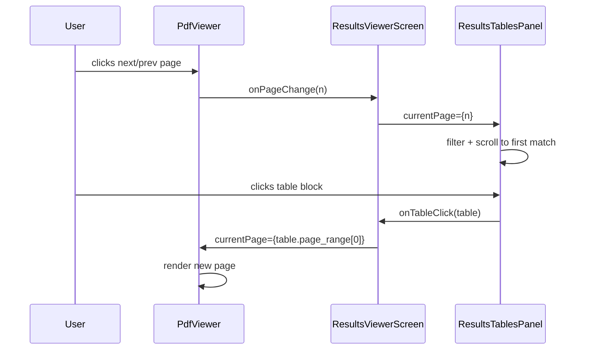

# Design Document: PDF–Table Sync

## Overview

This feature adds bidirectional synchronisation between the PDF viewer and the extracted tables panel in `ResultsViewerScreen`. The core change is lifting `currentPage` state out of `PdfViewer` (where it currently lives as internal state) up to the shared parent `ResultsViewerScreen`, then threading it down as props to both `PdfViewer` and `ResultsTablesPanel`.

The result is a controlled data flow: the parent owns the single source of truth for the active page, and both child panels read from and write to it through well-defined prop interfaces. A "Show all tables" toggle lets users opt out of page-filtered views when they want to review the full extraction output.

No new dependencies are required. The stack is React 18 + Vite + Vitest + `@testing-library/react` + `fast-check`.

---

## Architecture

### Before (current state)

```
ResultsViewerScreen
├── PdfViewer          ← owns currentPage internally
│     └── [internal state: currentPage, totalPages]
└── ResultsTablesPanel ← unaware of current page
```

### After (target state)

```
ResultsViewerScreen   ← owns currentPage, totalPages, showAllTables
├── PdfViewer          ← controlled: receives currentPage, onPageChange, reports totalPages
└── ResultsTablesPanel ← receives currentPage, onTableClick, showAllTables, onToggleShowAll
```

### Data flow

```
User navigates PDF page
  → PdfViewer calls onPageChange(n)
    → ResultsViewerScreen sets currentPage = n
      → ResultsTablesPanel re-renders with new currentPage
        → filtered tables update, first match scrolls into view

User clicks a table block
  → ResultsTablesPanel calls onTableClick(table)
    → ResultsViewerScreen sets currentPage = table.page_range[0]
      → PdfViewer re-renders the new page
```

### Mermaid diagram



---

## Components and Interfaces

### ResultsViewerScreen (state owner)

New state variables added to the existing component:

```jsx
const [currentPage, setCurrentPage] = useState(1);
const [totalPages, setTotalPages] = useState(0);
const [showAllTables, setShowAllTables] = useState(false);
```

New handlers:

```jsx
// Called by PdfViewer when the user navigates
function handlePageChange(page) {
  const clamped = Math.max(1, Math.min(totalPages || 1, page));
  setCurrentPage(clamped);
}

// Called by PdfViewer once the PDF loads and numPages is known
function handleTotalPages(n) {
  setTotalPages(n);
}

// Called by ResultsTablesPanel when a table block is clicked
function handleTableClick(table) {
  if (!table.page_range || table.page_range.length === 0) return;
  const target = table.page_range[0];
  const clamped = Math.max(1, Math.min(totalPages || 1, target));
  setCurrentPage(clamped);
}
```

Updated render of `PdfViewer`:

```jsx
<PdfViewer
  jobId={jobId}
  highlights={pdfHighlights}
  currentPage={currentPage}
  onPageChange={handlePageChange}
  onTotalPages={handleTotalPages}
/>
```

Updated render of `ResultsTablesPanel`:

```jsx
<ResultsTablesPanel
  tables={tables}
  currentPage={currentPage}
  onTableClick={handleTableClick}
  showAllTables={showAllTables}
  onToggleShowAll={() => setShowAllTables((v) => !v)}
/>
```

---

### PdfViewer (controlled component)

**New props:**

| Prop | Type | Required | Description |
|---|---|---|---|
| `currentPage` | `number` | yes | The page to render, controlled by parent |
| `onPageChange` | `(page: number) => void` | yes | Called when user navigates; parent updates state |
| `onTotalPages` | `(total: number) => void` | no | Called once after PDF loads with `doc.numPages` |

**Removed internal state:** `currentPage` and `setCurrentPage` are removed. `totalPages` remains internal (it is a property of the loaded document, not shared state).

**Clamping:** `PdfViewer` clamps the incoming `currentPage` prop before passing it to `pdfDoc.getPage()`:

```js
const safePage = Math.max(1, Math.min(totalPages || 1, currentPage));
```

This is a defensive render-time clamp only — it does not call `onPageChange` with the clamped value, keeping the component truly controlled.

**Navigation buttons** now call `onPageChange` instead of `setCurrentPage`:

```jsx
<button
  aria-label="Previous page"
  onClick={() => onPageChange(currentPage - 1)}
  disabled={currentPage <= 1}
>←</button>

<button
  aria-label="Next page"
  onClick={() => onPageChange(currentPage + 1)}
  disabled={currentPage >= totalPages}
>→</button>
```

**Zoom** remains internal state — zoom level is a view preference, not shared with other panels.

**`highlights` navigation side-effect** is removed. Previously, `PdfViewer` had a `useEffect` that called `setCurrentPage(highlights[0].page)` when highlights changed. Since the component is now controlled, this side-effect is removed. The parent (`ResultsViewerScreen`) is responsible for setting `currentPage` when it sets `pdfHighlights`.

---

### ResultsTablesPanel (page-aware)

**New props:**

| Prop | Type | Required | Description |
|---|---|---|---|
| `currentPage` | `number` | yes | Active page from parent |
| `onTableClick` | `(table: Table) => void` | yes | Called when user clicks a table block |
| `showAllTables` | `boolean` | yes | When true, bypass page filter |
| `onToggleShowAll` | `() => void` | yes | Called when toggle is activated/deactivated |

**Page filtering logic:**

```js
const visibleTables = showAllTables
  ? tables
  : tables.filter((t) => t.page_range && t.page_range.includes(currentPage));
```

**Scroll-to-first-match** using `useRef`:

```jsx
const firstMatchRef = useRef(null);

useEffect(() => {
  if (!showAllTables && firstMatchRef.current) {
    firstMatchRef.current.scrollIntoView({ behavior: "smooth", block: "nearest" });
  }
}, [currentPage, showAllTables]);
```

The ref is attached to the first element in `visibleTables` during render.

**Active-page highlight style** applied to each visible table block:

```js
const isActive = !showAllTables && table.page_range.includes(currentPage);
// Applied as inline style:
borderLeft: isActive ? "3px solid var(--color-info)" : "3px solid transparent",
backgroundColor: isActive ? "rgba(52,152,219,0.04)" : undefined,
```

**Clickable affordance** — each table block becomes a `<button>` element (or `role="button"` div with `tabIndex={0}` and keyboard handler):

```jsx
<div
  role="button"
  tabIndex={0}
  style={{ ...styles.tableBlock, cursor: "pointer" }}
  onClick={() => onTableClick(table)}
  onKeyDown={(e) => {
    if (e.key === "Enter" || e.key === " ") {
      e.preventDefault();
      onTableClick(table);
    }
  }}
>
```

**"Show all tables" toggle:**

```jsx
{tables.length > 0 && (
  <label style={styles.toggleLabel}>
    <input
      type="checkbox"
      checked={showAllTables}
      onChange={onToggleShowAll}
      aria-label="Show all tables"
    />
    Show all tables
  </label>
)}
```

**"No tables on this page" message** (shown when filtered view is empty):

```jsx
{!showAllTables && visibleTables.length === 0 && (
  <div style={styles.emptyPage}>No tables on this page.</div>
)}
```

---

## Data Models

### Table object (existing, unchanged)

```ts
interface Table {
  table_id: string;
  type: string;
  page_range: number[];   // 1-indexed page numbers
  headers: string[];
  rows: Record<string, unknown>[];
  triangulation: {
    score: number | null;
    verdict: "agreement" | "soft_flag" | "hard_flag";
    winner: string | null;
    methods: string[];
  } | null;
}
```

`page_range` is the key field for synchronisation. A table with `page_range: [3, 4]` is visible when `currentPage` is `3` or `4`.

### Page state (new, owned by ResultsViewerScreen)

```ts
// State variables in ResultsViewerScreen
currentPage: number   // always in [1, totalPages], initialised to 1
totalPages: number    // 0 until PDF loads, then doc.numPages
showAllTables: boolean // false by default
```

### Prop interfaces (new)

```ts
// PdfViewer props (additions only)
interface PdfViewerProps {
  jobId: string;
  highlights?: Highlight[];
  currentPage: number;          // NEW — controlled
  onPageChange: (page: number) => void;  // NEW
  onTotalPages?: (total: number) => void; // NEW
}

// ResultsTablesPanel props (additions only)
interface ResultsTablesPanelProps {
  tables: Table[];
  currentPage: number;          // NEW
  onTableClick: (table: Table) => void;  // NEW
  showAllTables: boolean;       // NEW
  onToggleShowAll: () => void;  // NEW
}
```

---

## Correctness Properties

*A property is a characteristic or behavior that should hold true across all valid executions of a system — essentially, a formal statement about what the system should do. Properties serve as the bridge between human-readable specifications and machine-verifiable correctness guarantees.*

### Property 1: Active Page is always within valid bounds

*For any* `totalPages` value and any sequence of requested page numbers (including values below 1 or above `totalPages`), the `clampPage` function SHALL always return an integer satisfying `1 ≤ result ≤ totalPages`. When `totalPages` is 0 (PDF not yet loaded), the result SHALL be 1.

**Validates: Requirements 5.1, 5.2, 5.3, 1.5, 1.6**

---

### Property 2: Page filter is consistent with currentPage

*For any* list of tables and any `currentPage` value, when `showAllTables` is false, every table returned by the filter SHALL have a `page_range` that includes `currentPage`, and every table whose `page_range` includes `currentPage` SHALL appear in the filtered result (no false positives, no false negatives).

**Validates: Requirements 2.1, 4.2**

---

### Property 3: Show-all toggle is a superset of page-filtered view

*For any* list of tables and any `currentPage`, the set of tables visible when `showAllTables` is true SHALL equal the full `tables` array, and SHALL be a superset of the page-filtered set. Toggling `showAllTables` on then off SHALL return the same filtered set as if the toggle had never been activated.

**Validates: Requirements 2.4, 4.3, 4.4**

---

### Property 4: Table click sets page to first element of page_range (clamped)

*For any* table with a non-empty `page_range` and any `totalPages ≥ 1`, the resolved page from a table click SHALL equal `clamp(table.page_range[0], 1, totalPages)`.

**Validates: Requirements 3.1, 5.3**

---

### Property 5: Toggle state is preserved across page changes

*For any* `showAllTables` boolean value and any new `currentPage`, applying a page change to the component state SHALL leave `showAllTables` unchanged.

**Validates: Requirements 4.5**

---

### Property 6: Keyboard activation is equivalent to mouse click on table blocks

*For any* table block with a non-empty `page_range`, pressing Enter or Space while the block has keyboard focus SHALL invoke `onTableClick` with the same table object as a mouse click on that block would.

**Validates: Requirements 7.3**

---

## Error Handling

### PDF load failure
`PdfViewer` already handles fetch errors and renders an error panel. No change needed. `totalPages` remains `0` and `currentPage` stays at `1`; navigation buttons are disabled.

### PDF page render failure
If `pdfDoc.getPage(safePage)` throws, the existing `try/catch` in `renderPage` logs the error. Requirement 3.3 asks for a retry — the implementation adds a single retry with a 300 ms delay before setting an error state:

```js
try {
  await renderPage(safePage);
} catch {
  await new Promise((r) => setTimeout(r, 300));
  try {
    await renderPage(safePage);
  } catch (err) {
    setError(`Failed to render page ${safePage}: ${err.message}`);
  }
}
```

### Empty page_range on table click
`handleTableClick` in `ResultsViewerScreen` guards against empty `page_range` and leaves `currentPage` unchanged (Requirement 3.2).

### totalPages = 0 (PDF not yet loaded)
`handlePageChange` and `handleTableClick` both clamp against `Math.max(1, totalPages || 1)`, so navigation attempts before load are silently clamped to page 1 (Requirement 5.2).

### No tables on current page
`ResultsTablesPanel` renders the "No tables on this page." message when `visibleTables.length === 0` and `showAllTables` is false (Requirement 2.3).

---

## Testing Strategy

### Unit tests (Vitest + @testing-library/react)

**PdfViewer controlled component** (`PdfViewer.test.jsx`):
- Renders without error when `currentPage` and `onPageChange` props are provided
- Calls `onPageChange` with `currentPage - 1` when previous button is clicked
- Calls `onPageChange` with `currentPage + 1` when next button is clicked
- Disables previous button when `currentPage === 1`
- Disables next button when `currentPage === totalPages`
- Clamps render to page 1 when prop is `< 1` (does not call `onPageChange`)
- Clamps render to `totalPages` when prop exceeds it
- Navigation buttons have descriptive `aria-label` attributes

**ResultsTablesPanel filtering** (`ResultsTablesPanel.test.jsx`):
- Shows only tables matching `currentPage` when `showAllTables` is false
- Shows all tables when `showAllTables` is true
- Renders "No tables on this page." when no tables match and `showAllTables` is false
- Does NOT render "No tables on this page." when `showAllTables` is true
- Calls `onTableClick` with the correct table when a table block is clicked
- Calls `onTableClick` when Enter or Space is pressed on a focused table block
- Toggle checkbox is present and has accessible label
- Calls `onToggleShowAll` when toggle is changed
- Active-page tables have the highlight border style applied

**Integration test** (`ResultsViewerScreen.sync.test.jsx`):
- Clicking a table block in `ResultsTablesPanel` updates `currentPage` in `PdfViewer`
- Navigating in `PdfViewer` updates the visible tables in `ResultsTablesPanel`
- Existing tabs (Fields, Abstentions, Validation) still render correctly after sync wiring

### Property-based tests (fast-check)

Each property test runs a minimum of **100 iterations**. Tests are tagged with a comment referencing the design property. The pure logic functions (`clampPage`, `filterTablesByPage`, `resolveTableClickPage`, `applyPageChange`) are extracted from the components and tested in isolation so no DOM rendering is needed for the property tests.

**`sync.property.test.js`**:

```js
// Feature: pdf-table-sync, Property 1: Active Page is always within valid bounds
fc.assert(fc.property(
  fc.integer({ min: 0, max: 100 }),          // totalPages (0 = not yet loaded)
  fc.array(fc.integer({ min: -10, max: 110 })), // sequence of requested pages
  (totalPages, requests) => {
    requests.forEach((req) => {
      const result = clampPage(req, totalPages);
      expect(result).toBeGreaterThanOrEqual(1);
      expect(result).toBeLessThanOrEqual(Math.max(1, totalPages));
    });
  }
), { numRuns: 100 });
```

```js
// Feature: pdf-table-sync, Property 2: Page filter is consistent with currentPage
fc.assert(fc.property(
  fc.array(tableArbitrary),
  fc.integer({ min: 1, max: 50 }),
  (tables, currentPage) => {
    const visible = filterTablesByPage(tables, currentPage);
    // No false positives
    visible.forEach((t) => expect(t.page_range).toContain(currentPage));
    // No false negatives
    tables
      .filter((t) => t.page_range.includes(currentPage))
      .forEach((t) => expect(visible).toContain(t));
  }
), { numRuns: 100 });
```

```js
// Feature: pdf-table-sync, Property 3: Show-all is superset of page-filtered; toggle round-trip
fc.assert(fc.property(
  fc.array(tableArbitrary),
  fc.integer({ min: 1, max: 50 }),
  (tables, currentPage) => {
    // Show-all equals full list
    expect(tables).toHaveLength(tables.length); // trivially true — show-all returns tables as-is
    // Toggle round-trip: on then off = same as always-off
    const filteredDirect = filterTablesByPage(tables, currentPage);
    const filteredRoundTrip = filterTablesByPage(tables, currentPage); // toggle off restores filter
    expect(filteredRoundTrip).toEqual(filteredDirect);
  }
), { numRuns: 100 });
```

```js
// Feature: pdf-table-sync, Property 4: Table click sets page to first page_range element (clamped)
fc.assert(fc.property(
  fc.array(fc.integer({ min: 1, max: 50 }), { minLength: 1 }),
  fc.integer({ min: 1, max: 100 }),
  (pageRange, totalPages) => {
    const table = { page_range: pageRange };
    const result = resolveTableClickPage(table, totalPages);
    const expected = Math.max(1, Math.min(totalPages, pageRange[0]));
    expect(result).toBe(expected);
  }
), { numRuns: 100 });
```

```js
// Feature: pdf-table-sync, Property 5: Toggle state is preserved across page changes
fc.assert(fc.property(
  fc.boolean(),
  fc.integer({ min: 1, max: 50 }),
  (showAllTables, newPage) => {
    const state = { currentPage: 1, showAllTables };
    const next = applyPageChange(state, newPage);
    expect(next.showAllTables).toBe(showAllTables);
  }
), { numRuns: 100 });
```

```js
// Feature: pdf-table-sync, Property 6: Keyboard activation is equivalent to mouse click
// Tested via @testing-library/react userEvent — for any table, Enter and Space fire onTableClick
fc.assert(fc.property(
  tableArbitrary,
  async (table) => {
    const onTableClick = vi.fn();
    const { getByRole } = render(
      <ResultsTablesPanel
        tables={[table]}
        currentPage={table.page_range[0] ?? 1}
        onTableClick={onTableClick}
        showAllTables={true}
        onToggleShowAll={() => {}}
      />
    );
    const block = getByRole("button", { name: new RegExp(table.table_id) });
    await userEvent.click(block);
    const clickCallCount = onTableClick.mock.calls.length;
    onTableClick.mockClear();
    block.focus();
    await userEvent.keyboard("{Enter}");
    expect(onTableClick).toHaveBeenCalledTimes(clickCallCount);
  }
), { numRuns: 100 });
```

### Accessibility tests
- Toggle has `aria-label` or associated `<label>` (verified in unit tests via `getByRole("checkbox", { name: /show all tables/i })`)
- Table blocks are reachable by Tab and respond to Enter/Space (verified in unit tests via `userEvent.keyboard`)
- PdfViewer navigation buttons have `aria-label` (verified in unit tests via `getByRole("button", { name: /previous page/i })`)
