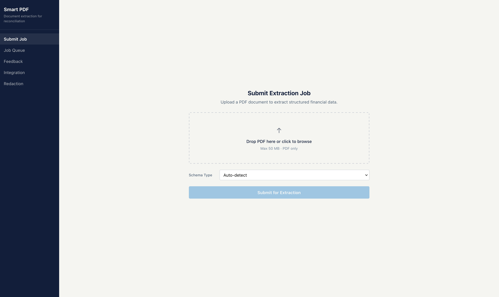

# Smart PDF

A back-office document extraction service for financial reconciliation. Processes bank statements, custody statements, SWIFT confirmations, settlement reports, and any unknown document type via auto-schema discovery — extracting structured data from any PDF format (digital or scanned).



## Features

- **Schema-agnostic extraction** — handles any table structure without hardcoded column definitions
- **Auto-schema discovery** — when a document doesn't match known schemas, uses VLM to discover the structure and extract dynamically
- **Two-phase LLM architecture** — metadata extraction + per-window transaction extraction (never hits output token limits)
- **Multi-section document support** — splits composite PDFs by schema type, processes sections in parallel
- **OCR for scanned documents** — Tesseract with parallel page processing
- **Real-time progress tracking** — pages processed, current stage, ETA
- **Validation checks** — balance reconciliation, running balance, column type consistency, completeness
- **Professional operational frontend** — dark navy UI with job queue, results viewer, and integration guide

## Architecture

```
PDF Upload → Ingestion → Classification → OCR/Digital Extraction
    → Section Segmentation → Schema Detection → Rule-based Extraction
    → VLM Fallback (Bedrock Claude) → Auto-Schema Discovery (if unknown)
    → Validation → Packaging → Delivery
```

## Prerequisites

Before running the service, ensure you have:

| Requirement | Version | Installation |
|---|---|---|
| Python | 3.11+ | [python.org](https://www.python.org/downloads/) |
| Tesseract OCR | 5.x | See below |
| Node.js | 18+ | [nodejs.org](https://nodejs.org/) (for frontend) |
| AWS credentials | — | For Bedrock VLM access |

### Installing Tesseract OCR

Tesseract is required for processing scanned PDF pages.

**macOS:**
```bash
brew install tesseract
```

**Ubuntu/Debian:**
```bash
sudo apt-get install tesseract-ocr
```

**Windows:**
Download from [UB Mannheim](https://github.com/UB-Mannheim/tesseract/wiki) and add to PATH.

**Verify installation:**
```bash
tesseract --version
```

### AWS Bedrock Access

The VLM fallback requires AWS Bedrock access to Claude. You need:

1. An AWS account with Bedrock model access enabled for Claude Sonnet
2. IAM credentials with `bedrock:InvokeModel` permission
3. The model must be enabled in your chosen region

```json
{
  "Version": "2012-10-17",
  "Statement": [
    {
      "Effect": "Allow",
      "Action": ["bedrock:InvokeModel"],
      "Resource": ["arn:aws:bedrock:us-east-1::foundation-model/us.anthropic.claude-sonnet-4-6"]
    }
  ]
}
```

## Quick Start

### Backend

```bash
cd pdf_ingestion

# Create virtual environment
python -m venv .venv
source .venv/bin/activate  # On Windows: .venv\Scripts\activate

# Install dependencies
pip install -e ".[dev]"

# Copy environment config
cp .env.example .env
# Edit .env with your AWS credentials and settings

# Run the server
uvicorn api.main:app --port 8000
```

### Frontend

```bash
cd pdf_ingestion/frontend

# Install dependencies
npm install

# Run dev server (proxies API to localhost:8000)
npm run dev
```

Open http://localhost:3001 in your browser.

## API Endpoints

| Method | Endpoint | Description |
|--------|----------|-------------|
| POST | `/v1/extract` | Submit a PDF for extraction |
| GET | `/v1/jobs/{id}` | Check job status |
| GET | `/v1/jobs/{id}/progress` | Real-time progress |
| GET | `/v1/results/{id}` | Get extraction results |
| POST | `/v1/jobs/{id}/cancel` | Cancel a processing job |
| POST | `/v1/feedback/{id}` | Submit a correction |
| GET | `/v1/tenants/{id}/schema-cache` | List cached discovered schemas |
| DELETE | `/v1/tenants/{id}/schema-cache/{fingerprint}` | Invalidate a cached schema |

## Configuration

Key environment variables (`.env`):

```bash
# Required
AWS_REGION=us-east-1
BEDROCK_MODEL_ID=us.anthropic.claude-sonnet-4-6

# VLM extraction settings
VLM_MAX_TOKENS_PER_JOB=500000      # Max tokens per job (controls cost)
VLM_MAX_CONCURRENT_WINDOWS=10       # Parallel Bedrock calls
VLM_BUDGET_EXCEEDED_ACTION=flag     # flag|skip|proceed

# Auto-schema discovery
DISCOVERY_SAMPLE_PAGES=5            # Pages sampled for schema analysis
DISCOVERY_CACHE_ENABLED=true        # Cache discovered schemas for reuse

# File limits
MAX_FILE_SIZE_MB=100
```

See `.env.example` for all available settings.

## How It Works

### Known Document Types
For bank statements, custody statements, and SWIFT confirmations, the pipeline uses:
1. Keyword-based schema detection
2. Rule-based regex extraction (fast, deterministic)
3. VLM fallback for fields that regex can't resolve

### Unknown Document Types (Auto-Schema Discovery)
For documents that don't match any known schema:
1. VLM analyses the first 5 pages to discover the document structure
2. Produces a schema definition (field names, table headers, locations)
3. Uses the discovered schema to extract fields and tables via VLM
4. Caches the schema for future documents of the same type

### Processing Pipeline
```
Ingestion (validate, dedup, repair)
    → Classification (per-page: digital or scanned)
    → Extraction (pdfplumber for digital, Tesseract for scanned)
    → Triangulation (compare pdfplumber vs camelot tables)
    → Assembly (reading order, table stitching)
    → Schema Detection (keyword density analysis)
    → Schema Extraction (regex patterns) OR Auto-Discovery (VLM)
    → VLM Fallback (for abstained fields, if tenant has VLM enabled)
    → Validation (checksums, date ranges, format checks)
    → Packaging (final JSON output with provenance)
    → Delivery (webhook push to callback URL)
```

## Tech Stack

- **Backend**: Python 3.11+, FastAPI, pdfplumber, Tesseract OCR, AWS Bedrock (Claude)
- **Frontend**: React 18, Vite, React Router v6
- **Testing**: pytest + hypothesis (backend), Vitest + fast-check (frontend)
- **Database**: PostgreSQL 16 (optional — in-memory stores used for local dev)

## Project Structure

```
pdf_ingestion/
├── api/              # FastAPI routes, middleware, models
│   ├── main.py       # App factory, lifespan, router registration
│   ├── config.py     # Settings (all env vars)
│   ├── errors.py     # Error code registry
│   ├── middleware/    # Auth, RBAC, log sink
│   ├── models/       # Pydantic request/response models
│   └── routes/       # Route handlers
├── pipeline/         # Extraction pipeline stages
│   ├── runner.py     # End-to-end orchestration
│   ├── discovery/    # Auto-schema discovery
│   │   ├── auto_discovery.py    # VLM schema analysis
│   │   ├── dynamic_extractor.py # Extraction using discovered schemas
│   │   └── schema_cache.py      # Schema caching
│   ├── vlm/          # LLM extraction (Bedrock client, chunked extractor)
│   ├── extractors/   # OCR and digital extractors
│   ├── schemas/      # Schema-specific regex extractors
│   └── alerts/       # Alert engine
├── frontend/         # React + Vite operational UI
│   └── src/
│       ├── components/   # Reusable UI components
│       └── screens/      # Page-level screens
├── db/               # Database models and migrations
├── tests/            # Test suite
├── pyproject.toml    # Dependencies and tool config
├── .env.example      # Environment variable template
├── Dockerfile        # Multi-stage production build
└── docker-compose.yml # Local development stack
```

## Running Tests

```bash
cd pdf_ingestion

# Run all tests
pytest

# Run with verbose output
pytest -v

# Run specific test file
pytest tests/test_ingestion.py
```

## Troubleshooting

### "ExpiredTokenException" from Bedrock
Your AWS session token has expired. Refresh credentials:
```bash
aws sso login --profile your-profile
# or re-export AWS_ACCESS_KEY_ID, AWS_SECRET_ACCESS_KEY, AWS_SESSION_TOKEN
```

### "ERR_VLM_003: VLM returned null"
The VLM couldn't find the requested fields in the document. This happens when:
- The document type doesn't match the expected schema
- The document content is too noisy for extraction
- Auto-schema discovery is disabled (`vlm_enabled=false` for the tenant)

### "ERR_EXTRACT_002: Document structural signals do not match any known schema"
The document doesn't match bank_statement, custody_statement, or swift_confirm keywords. If VLM is enabled, auto-schema discovery will attempt to identify the structure.

### Tesseract not found
Ensure Tesseract is installed and on your PATH:
```bash
which tesseract  # Should return a path
tesseract --version  # Should show version 5.x
```

### Slow processing on large documents
Documents with 100+ pages take several minutes due to:
- OCR processing (Tesseract, ~0.5-1.5s per page)
- VLM API calls (~2-4s per window, multiple windows for large docs)

Reduce cost/time by lowering `VLM_MAX_TOKENS_PER_JOB` or setting `VLM_BUDGET_EXCEEDED_ACTION=skip`.

## License

Proprietary — internal use only.
